# 数字工作伙伴平台

企业级 **岗位数字工作伙伴** 编排与治理控制台：把大模型、企业知识、技能/工具与工作流，装配为可上岗的数字工作伙伴，在受控边界内完成协作、执行与审计。

> **安全零信任，驱动先进生产力**  
> 持续验证守住身份、权限、数据与执行边界；以能力复用与用量治理，让每一次协同可托付、可度量。

冷启动即带 **办公开箱**（知识 × 技能 × 流程 + `de-office` 办公助手）：制度问答、会议纪要、周报、假勤等场景无需先手工灌库。

| | |
|:--|:--|
| **默认联调** | 真实 API（`VITE_USE_MOCK=false`）→ Vite 代理 `de-gateway :8089` |
| **纯前端演示** | `cd frontend/web && npm run dev:demo` |
| **合规目标** | 等保 3 / ISO 27001 |

---

## 目录

- [产品主轴](#产品主轴)
- [品牌能力支柱](#品牌能力支柱)
- [快速开始](#快速开始)
- [控制台一览](#控制台一览)
- [能力地图](#能力地图)
- [办公开箱](#办公开箱)
- [能力供给（五中心）](#能力供给五中心)
- [功能模块](#功能模块)（含 [交互图](#功能模块交互图)）
- [技术架构](#技术架构)（含 [部署架构图](#部署架构图) · [逻辑拓扑](#逻辑拓扑) · [数据流时序图](#数据流时序图)）
- [本地部署](#本地部署)
- [验证与常见问题](#验证与常见问题)
- [文档索引](#文档索引)
- [路线图](#路线图)

---

## 产品主轴

一切能力围绕 **一位数字工作伙伴** 运转：先装配可信身份，再进入人机协同，最后沉淀可度量结果。模型 / 知识 / 技能 / 记忆 / 渠道是 **供给**，不是主叙事。

<p align="center">
  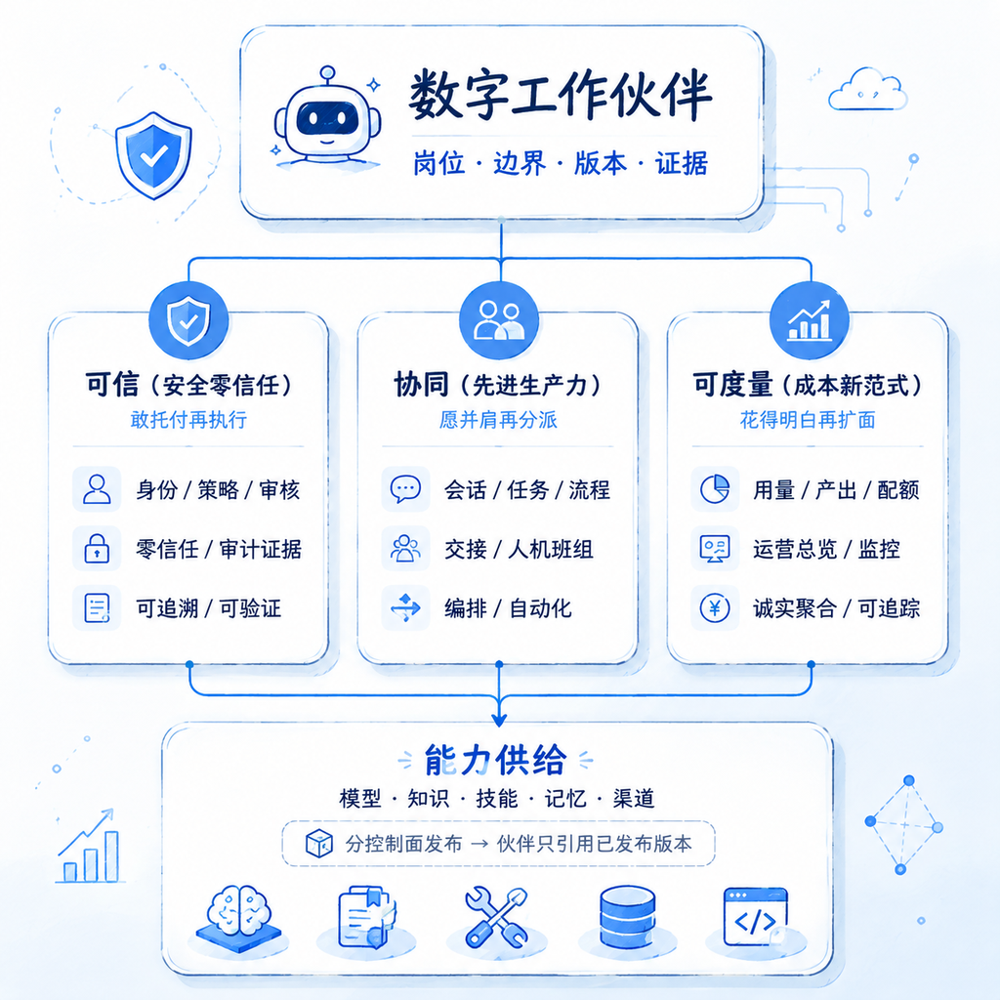
</p>

| 我们是 | 我们不是 |
|--------|----------|
| 以「谁在岗、能否托付、如何协同」为中心的运营控制面 | 模型广场、Prompt 玩具或裸跑 Agent 控制台 |
| 岗位级工作伙伴：有职责、有边界、有版本、有证据 | 一次性对话机器人 |
| 能力分控制面治理，伙伴只引用已发布版本 | 把模型 / 知识 / 技能堆在同一页里任选即用 |

价值流转：

```text
能力接入（含办公开箱预置） → 装配上岗 → 受控协同（研判 / 执行 / 审核 / 流程） → 运营复盘与审计
```

---

## 品牌能力支柱

企业把大模型推进生产时，常见困境是 **装不起来、管不住、说不清**。三支柱即产品回答：

<p align="center">
  
</p>

| 支柱 | 一句话 | 用户感知 |
|------|--------|----------|
| **安全零信任** | 敢托付 | 「他凭什么能做这件事，出事能否说清」 |
| **先进生产力** | 愿协作 | 「像靠谱同事一样并肩，而不是裸模型」 |
| **成本新范式** | 花得明白 | 「花了多少、换回什么，没有数就不假装有数」 |

---

## 快速开始

本机联调（**monolith** + 真实网关）最短路径：

```bash
# 1) Docker Postgres 16（勿用 Homebrew 抢 5432）
bash scripts/dev-stack/ensure-docker-postgres.sh

# 2) 控制面
cd backend && make compose-up-monolith
curl -sS http://127.0.0.1:8089/healthz

# 3) 前端
cd ../frontend && pnpm install && pnpm --filter web dev
# 打开 http://127.0.0.1:5173 ，用 admin@… 登录（密码任意非空）
```

建议验收：

1. **工作伙伴** → 可见 `de-office` 办公助手  
2. **工作流程 → 流程模板** → 默认「办公通用」；可切「个人创建」  
3. **知识 / 技能中心** → 办公知识包 published；岗位包 `office` 已安装  
4. **专家协作** → 选用办公助手做一次制度问答或纪要类对话  

改 Go 后：`cd backend && make build`，再 `launchctl kickstart -k "gui/$(id -u)/com.digital-employee.dev-stack"`。完整部署见 [本地部署](#本地部署)。

---

## 控制台一览

本地联调（`:5173` → 网关 `:8089`）界面示意（产品截图 2.0）：

| 运营总览 | 专家协作 |
|:-------:|:-------:|
| 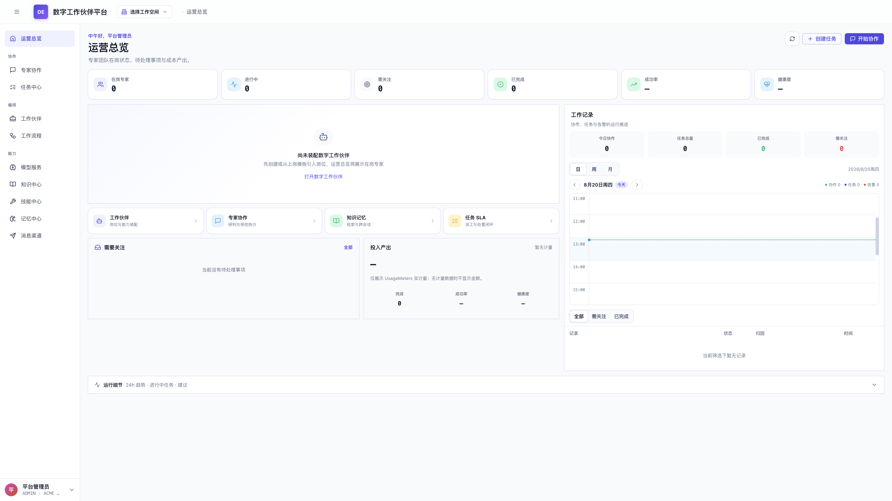 | 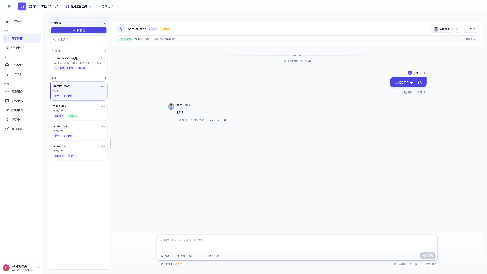 |
| 在岗 KPI、工作伙伴与工作记录直播聚合 | 与在岗伙伴流式协同；问答 / 方案 / 执行 |

| 工作伙伴 | 工作流程 |
|:-------:|:-------:|
| 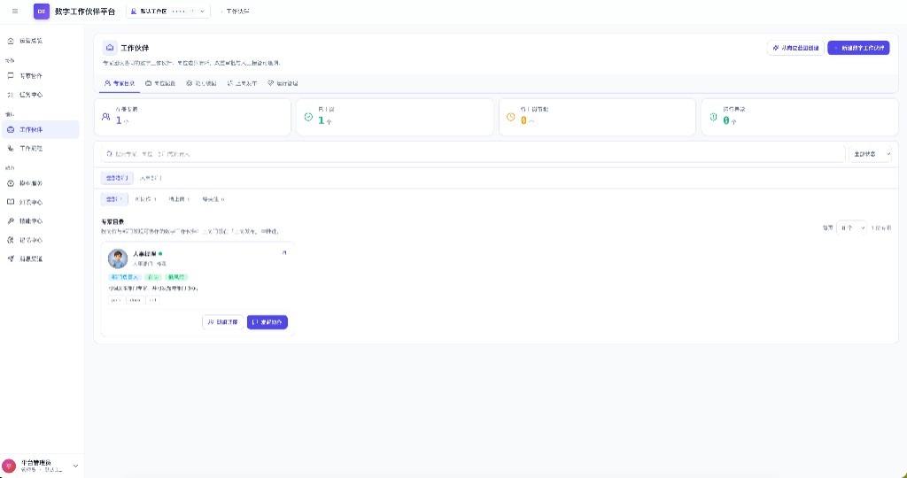 | 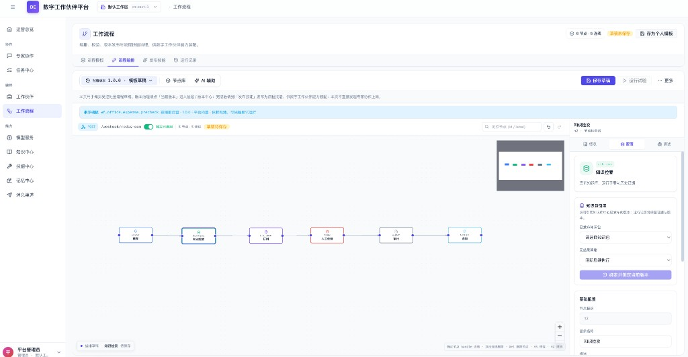 |
| 专家目录、上岗状态与进入对话 | 办公开箱流程编排（如 `wf.office.expense_precheck`） |

| 技能中心 |
|:-------:|
| 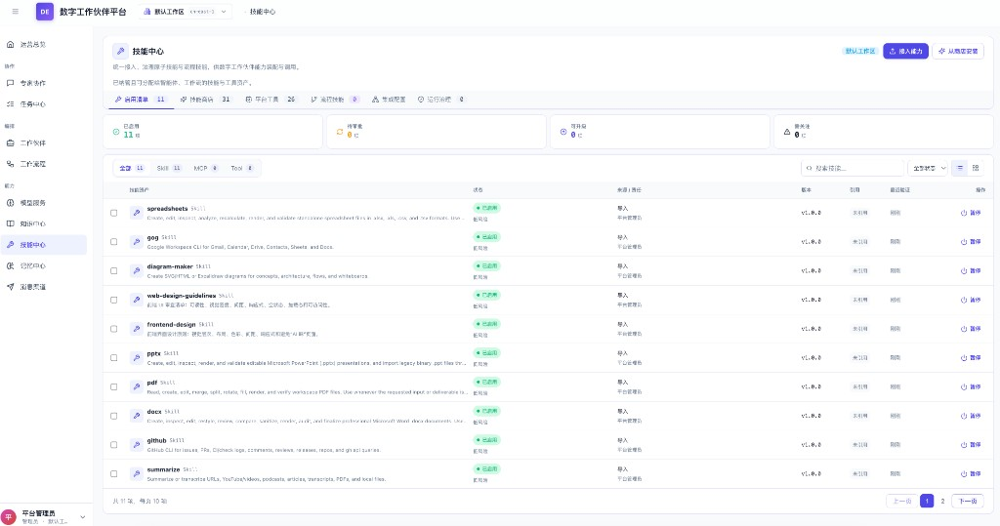 |
| 启用清单 / 技能商店 / 平台工具；含办公相关技能 |

原图：[`docs/images/product/`](docs/images/product/)。

---

## 能力地图

从上岗到信任治理，形成可运营的智能协同闭环：

<p align="center">
  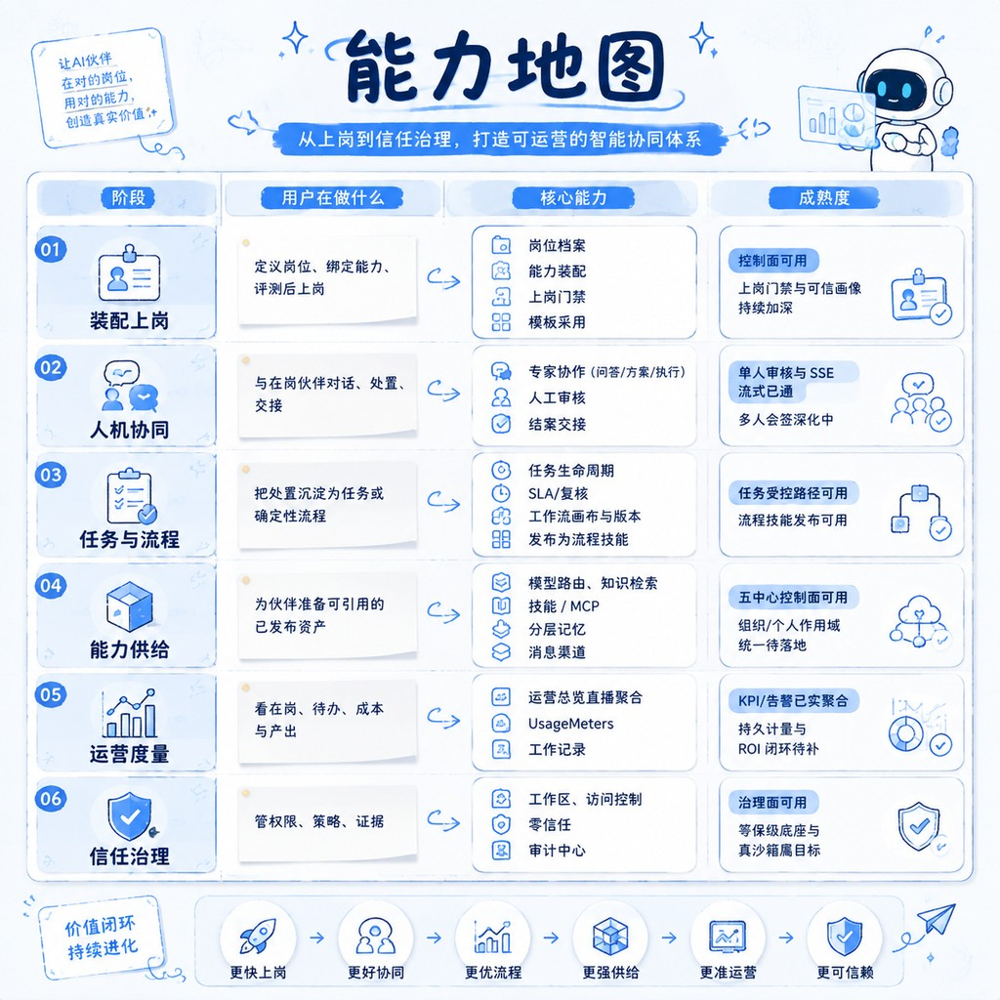
</p>

| 阶段 | 用户在做什么 | 成熟度摘要 |
|------|--------------|------------|
| **装配上岗** | 定义岗位、绑定能力、评测后上岗 | 控制面可用；含出厂 `de-office` |
| **人机协同** | 与在岗伙伴对话、处置、交接 | 单人审核与 SSE 流式已通 |
| **任务与流程** | 沉淀为任务或确定性流程 | 办公开箱/部门/个人模板；流程技能可发布 |
| **能力供给** | 准备已发布资产 | 五中心控制面可用 |
| **运营度量** | 看在岗、待办、成本与产出 | live-aggregate；无数则显示 `—` |
| **信任治理** | 管权限、策略、证据 | 治理面可用 |

---

## 办公开箱

面向「入职第一天就能干活」：制度问答、会议纪要、周报、文档审阅、假勤出差、报销自查、会议预约、IT 求助、通知拟稿、待办跟催等。部门审批剧目（入职/权限/合同等）仍在内置库中，**不作为办公默认主路径**。

| 入口 | 体验 |
|------|------|
| **工作流程 → 流程模板** | 「平台内置 / 个人创建」；默认筛 **办公通用**；「全部」平铺分页；卡片展示配套知识/技能 |
| **工作伙伴** | 出厂 **办公助手** `de-office` |
| **知识中心** | `kp.office.*` 六包冷启动 published |
| **技能中心** | 岗位包 `office` 对各工作区 `autoInstall` |

| 层 | 源码 | 冷启动 |
|----|------|--------|
| 知识 | `backend/builtin/knowledge/office/` | `EnsureBuiltinKnowledgeReady` |
| 技能 | `office`（`builtin/skills/manifest.json`） | `EnsureBuiltinSkillsReady` |
| 流程 | `wf.office.*` + 部门 Certified + 高级库 | `EnsureBuiltinWorkflowsReady`（不覆盖 `wft-user-*`） |
| 场景三联 | `backend/builtin/scenarios/office/` | 模板卡片标签来源 |
| 伙伴 | `de-office` | 与通用伙伴 ensure 同路径 |

细则：[`docs/环境与数据模式.md`](docs/环境与数据模式.md)。

---

## 能力供给（五中心）

能力分控制面治理；伙伴 **只引用已发布版本**。

<p align="center">
  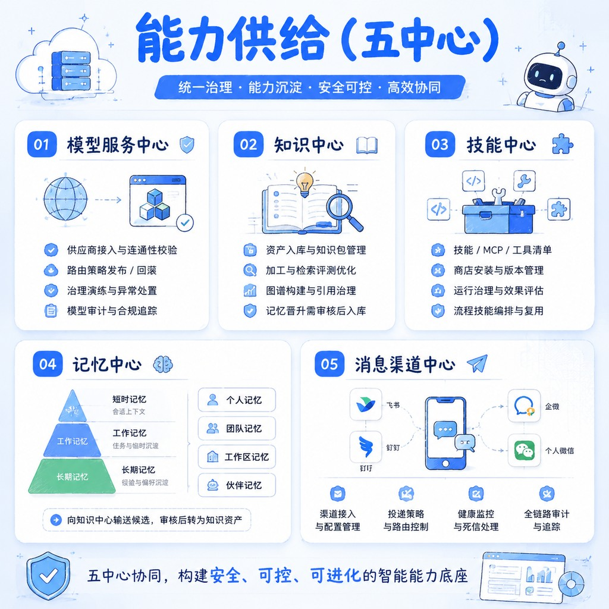
</p>

| 中心 | 要点 |
|------|------|
| **模型服务** | 供应商、路由发布/回滚、治理演练、审计 |
| **知识中心** | 资产与知识包、加工检索、图谱与引用；含办公开箱知识 |
| **技能中心** | 清单/商店/MCP、岗位包（`office` / `general`）、流程技能、运行治理 |
| **记忆中心** | 短时 / 工作 / 长期；向知识中心输送候选（需审核） |
| **消息渠道** | 飞书 / 钉钉 / 企微 / 个人微信；投递、健康、死信、审计 |

概念图：[`docs/images/brand/`](docs/images/brand/)。

---

## 功能模块

侧栏按**用户工作顺序**组织；底层 Agent 只作执行内核，**不作**一级入口。  
细则见 [`docs/数字工作伙伴平台-功能模块文档.md`](docs/数字工作伙伴平台-功能模块文档.md)。

### 导航信息架构

```text
运营总览                                              ← 度量入口
协作：专家协作 → 任务中心                              ← 人机处置
编排：数字工作伙伴 → 工作流程                          ← 岗位与确定性路径
能力：模型 → 知识 → 技能 → 记忆 → 渠道                 ← 已发布资产供给
账号：工作区 · 平台设置
        └─ 访问控制 · 持续验证 · 审计中心              ← 信任治理
```

角色可见性（摘要）：`admin` 全量；`user` 侧重协作 / 已授权伙伴；`auditor` 侧重审计只读。

### 功能模块交互图

能力中心**发布版本**，编排模块**只引用**；协同与流程受审核 / 零信任约束，结果回写运营与审计。

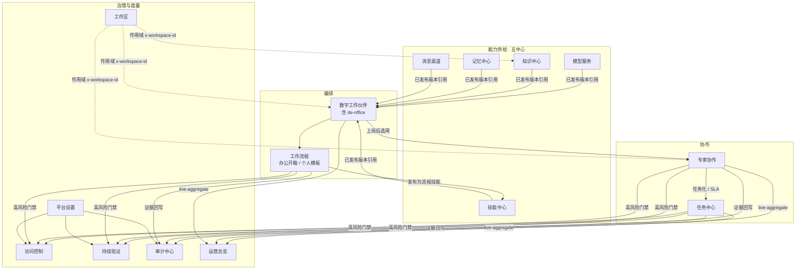

典型闭环：

1. **能力接入** → 五中心配置并发布（办公开箱已预置知识 / 技能）  
2. **装配上岗** → 伙伴绑定已发布版本（可直接用 `de-office`）  
3. **受控协同** → 专家协作或任务 / 流程处置；高风险走审核  
4. **复盘治理** → 运营总览看结果；审计中心留证据  

办公快捷路径：流程模板（办公通用）或直接与 `de-office` 对话。

### 模块一览

| ID | 模块 | 路由 | 分组 | 一句话 |
|----|------|------|------|--------|
| M01 | 运营总览 | `/home` | 运营 | 直播 KPI、需关注、投入产出、工作记录 |
| M02 | 专家协作 | `/copilot` | 协作 | 与在岗伙伴会话；研判 / 执行、审核、交接 |
| M03 | 任务中心 | `/tasks` | 协作 | 任务生命周期、复核与 SLA |
| M04 | 工作区 | `/workspaces` | 账号 | 业务域隔离、环境与配额 |
| M05 | 数字工作伙伴 | `/partners` | 编排 | 岗位装配与上岗；含 `de-office` |
| M06 | 工作流程 | `/workflows` | 编排 | 办公开箱 / 部门 / 个人模板；画布与发布 |
| M07 | 模型服务 | `/models` | 能力 | 供应商、路由发布 / 回滚、治理审计 |
| M08 | 知识中心 | `/knowledge` | 能力 | 资产与知识包；含办公开箱 `kp.office.*` |
| M09 | 技能中心 | `/skills` | 能力 | 清单 / 商店 / 岗位包（含 `office`）/ 流程技能 |
| M10 | 记忆中心 | `/memory` | 能力 | 三层记忆、晋升候选 |
| M11 | 消息渠道 | `/channels` | 能力 | 飞书 / 钉钉 / 企微等接入与投递 |
| M12 | 平台设置 | `/settings` | 账号 | 组织壳与运营设置 |
| M13 | 访问控制 | settings / 独立 | 治理 | 授权、发布审批、SoD |
| M14 | 持续验证 | settings / 独立 | 治理 | 零信任策略与临时授权 |
| M15 | 审计中心 | settings / 独立 | 治理 | 只读追溯与脱敏导出 |

---

## 技术架构

**控制面管可信与编排，执行面跑推理与工具，网关统一入口。**  
本地 / SME 默认 **monolith**：`de-gateway:8089` → `de-app:8100` + `de-skill-runtime:8093`（可选 `de-workflow:8103`）。

| 文档 | 用途 |
|------|------|
| [`docs/数字工作伙伴平台-架构文档.md`](docs/数字工作伙伴平台-架构文档.md) | L0 / L1 / L2 产品与领域架构 |
| [`docs/后端架构规划.md`](docs/后端架构规划.md) | 服务边界与演进阶段 |
| [`backend/deploy/topology-split.md`](backend/deploy/topology-split.md) | monolith / coarse 切流 |
| [`docs/环境与数据模式.md`](docs/环境与数据模式.md) | `DE_ENV`、Persist、办公开箱冷启动 |

### 文档分层

| 层 | 含义 | 现状 |
|----|------|------|
| **L0 控制面** | IA、模块能力、角色与治理闭环 | React 控制台 + monolith 联调（Mock 可选） |
| **L1 领域契约** | 工作区、权限、审核、零信任、审计事件 | 契约已落地；企业写路径持续硬化 |
| **L2 运行时底座** | Temporal、Milvus、真沙箱、K8s、SPIRE 等 | 选型锁定，按阶段补齐 |

### 架构原则

| 原则 | 含义 |
|------|------|
| **粗粒度部署** | 默认 monolith（`ModeApp` / `DomainAll`）；coarse 四进程可对照规模化 |
| **双栈分工** | Go：身份、策略、审计、资源编排；Python：Agent / RAG / Skill 沙箱 |
| **网关统一入口** | 浏览器只认 `:8089`；Vite 开发态同源 `/api` 代理到网关 |
| **工作区硬隔离** | 请求带 `x-workspace-id`；跨工作区引用拒绝 |
| **执行面不混部** | skill-runtime 必须独立；agent / rag 按需或 coarse 才启 |
| **能力只引用已发布** | 伙伴装配模型 / 知识 / 技能 / 渠道的已发布版本 |
| **可观测默认开** | 各服务 `/metrics`（含 `service` label） |

### 部署架构图

本机 / SME 默认 **Compose monolith**；规模化可切 coarse。浏览器只认网关 `:8089`。

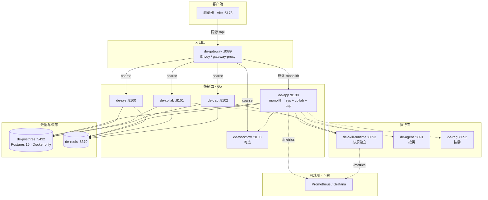

| 形态 | 组成 | 适用 |
|------|------|------|
| **monolith（默认）** | gateway + de-app + skill-runtime（± workflow） | 本地联调 / SME |
| **coarse** | gateway + sys/collab/cap/workflow + skill（± agent/rag） | 规模化对照 |
| **staging 拓扑** | coarse + Dex + OPA + OpenSearch + obs | 预发验收 |

启动：`make compose-up-monolith` 或 LaunchAgent（`scripts/dev-stack/run-stack.sh`）。改 Go 后须 `make build` 再重启栈。细则见 [`backend/deploy/topology-split.md`](backend/deploy/topology-split.md)。

### 逻辑拓扑

默认 **monolith**；规模化可切 **coarse** 四进程（同一网关入口）。

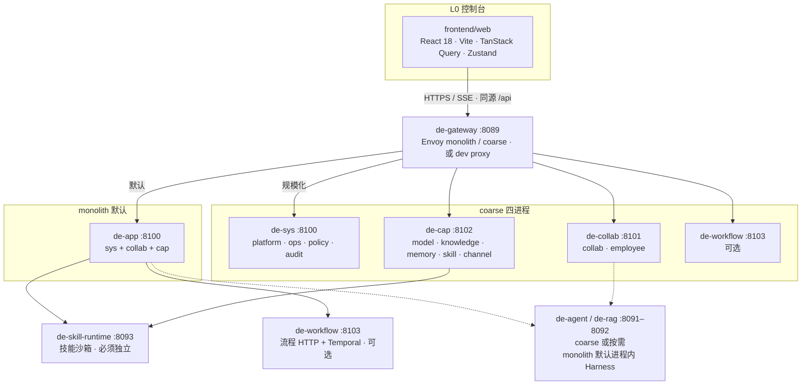

### 数据流时序图

专家协作发一条消息时的数据流（**monolith**；`de-app` 内含 sys / collab / cap 域逻辑）。高风险写操作可插入人工审核门禁后再执行工具。

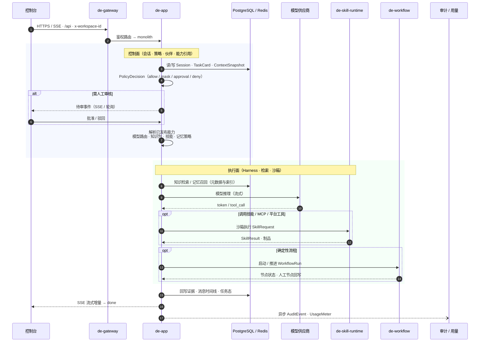

coarse 模式下，上图 `de-app` 内域调用拆到 `de-collab` / `de-sys`(policy) / `de-cap`；网关仍统一入口 `:8089`。完整扇出见 [`docs/后端架构规划.md`](docs/后端架构规划.md) §3.3。

### 部署单元

| 单元 | 端口 | 说明 |
|------|------|------|
| **de-gateway** | 8089 | 统一 API 入口；健康检查 `/healthz` |
| **de-app** | 8100 | **monolith 默认**：sys + collab + cap |
| de-sys / de-collab / de-cap | 8100–8102 | coarse：地基 / 协作编排 / 能力五中心 |
| de-workflow | 8103 | 工作流与流程技能发布（可选） |
| **de-skill-runtime** | 8093 | 技能沙箱（必须独立） |
| agent / rag | 8091–8092 | coarse 或按需 |

已退役：`de-core:8080`、细端口 `de-policy:8094` / `de-audit:8095`（能力由 de-app / de-sys 吸收）。

### 技术栈

| 层 | 技术 | 职责 |
|----|------|------|
| **前端** | React 18、TypeScript、Vite 5、pnpm Workspace、TanStack Query、Zustand、React Flow | 控制台 IA、联调与治理交互 |
| **控制面** | Go 1.24、Connect/Protobuf、PostgreSQL 16、Redis、`ServiceMode` | 身份、工作区、策略、审计、CRUD、运营聚合 |
| **执行面** | Python FastAPI；monolith 默认进程内 Harness | Agent 编排、RAG、Skill 沙箱 |
| **网关 / 基建** | Envoy；可选 Dex、OPA、OpenSearch、Temporal、Vault、Milvus、Kafka | 入口、IdP、策略引擎、编排、密钥、向量（目标/可选） |

### 关键契约（实现要点）

| 主题 | 约定 |
|------|------|
| **鉴权与角色** | Token + 工作区头；RBAC：`admin` / `user` / `auditor` |
| **持久化** | 控制面内存 + PG 快照；硬删须 `PersistDelete(Sync)`，仅 `Persist` 不会删掉旧行 |
| **环境** | `DE_ENV=development` 默认联调（空库 + hydrate，不灌 ACME seed）；`demo` 仅内存 |
| **运营聚合** | `/api/home/*`、`/api/operations/overview` 为 live-aggregate；成本仅认 UsageMeters，否则 `—` |
| **办公开箱** | 冷启动 ensure 知识包 / `autoInstall` 岗位包 / Certified 流程 / `de-office`；个人模板 `wft-user-*` 不覆盖 |
| **本机二进制** | LaunchAgent 读 `backend/bin/de-*`；改 Go 后须 `make build` 再 kickstart |
| **观测** | `/metrics`；Copilot 流式经网关超时约 180s |

### 仓库结构

```text
digital-employee-platform/
├── README.md                      # GitHub 项目介绍（本文件）
├── frontend/                      # pnpm workspace 控制台
│   ├── web/                       # React 18 + Vite 应用（:5173）
│   └── packages/                  # api · types · ui · utils · hooks
├── backend/                       # Go 控制面 + Python 执行面
│   ├── cmd/                       # de-app（默认）· de-sys · de-collab · de-cap
│   │                              # de-workflow · de-policy · de-audit · …
│   ├── builtin/                   # 出厂包（办公开箱）
│   │   ├── knowledge/office/      # kp.office.* 知识包
│   │   ├── skills/                # 岗位包 manifest（含 office autoInstall）
│   │   ├── workflows/             # wf.office.* + 部门 Certified + 高级库
│   │   └── scenarios/office/      # 知识·技能·流程三联
│   ├── internal/                  # apprun · server(ServiceMode) · store · policy …
│   ├── api/                       # routes.md · proto · 契约说明
│   ├── services/                  # 部署单元：Dockerfile · SERVICE.md · FastAPI
│   │                              # （de-app / de-skill-runtime / de-rag …）
│   ├── deploy/                    # compose · envoy.monolith/coarse · topology-split
│   ├── infra/ · obs/              # 基础依赖与可观测
│   ├── libs/ · pkg/ · gen/        # 共享库与生成代码
│   ├── runtimes/                  # 测试辅助（非部署入口）
│   ├── scripts/                   # purge-demo-seed 等运维脚本
│   ├── bin/                       # make build 产物（LaunchAgent 读取）
│   └── Makefile
├── scripts/
│   └── dev-stack/                 # ensure-docker-postgres · run-stack · gateway-proxy
├── docs/
│   ├── images/
│   │   ├── brand/                 # 产品主轴 / 三支柱 / 能力地图 / 五中心
│   │   └── product/               # 控制台截图 2.0
│   ├── adr/                       # 架构决策记录
│   ├── 环境与数据模式.md
│   ├── 数字工作伙伴平台-架构文档.md
│   ├── 数字工作伙伴平台-功能模块文档.md
│   └── …                          # 后端规划 · 规格 · 视觉等
└── .github/workflows/             # CI（如 backend-contract）
```

| 路径 | 说明 |
|------|------|
| `backend/cmd/de-app` | monolith 主进程入口（sys + collab + cap） |
| `backend/builtin/` | 冷启动由 `EnsureBuiltin*` 装载；见各子目录 README |
| `backend/bin/` | 本机常驻栈二进制；改 Go 后须 `make build` |
| `scripts/dev-stack/` | LaunchAgent 联调（默认 `DE_STACK=monolith`） |
| `docs/images/` | README 内联概念图与产品截图 |

出厂包入口：[`backend/builtin/workflows/README.md`](backend/builtin/workflows/README.md) · [`backend/builtin/knowledge/office/README.md`](backend/builtin/knowledge/office/README.md) · [`backend/builtin/scenarios/office/README.md`](backend/builtin/scenarios/office/README.md) · [`backend/README.md`](backend/README.md)。

### 演进边界

| 已成立 | 仍在路上 |
|--------|----------|
| **monolith 默认**（de-app + skill + gateway） | 组织 / 个人作用域统一、真 gVisor |
| 控制台真实网关 + 工作区隔离 + live-aggregate | Temporal / Milvus 生产化 |
| 办公开箱（知识×技能×流程）+ PilotDeck | Handler 六边形迁包、LangGraph 全图 |

分阶段计划见下方 [路线图](#路线图)。

---

## 本地部署

两条路径：**Compose**（首次推荐）与 **LaunchAgent**（日常改代码）。均经网关 `:8089`。细则：[`backend/README.md`](backend/README.md) · [`docs/环境与数据模式.md`](docs/环境与数据模式.md)。

### 环境要求

| 依赖 | 说明 |
|------|------|
| Docker / Colima | **唯一**提供 PG / Redis；禁止 Homebrew Postgres 占 5432 |
| Go 1.24+ | 可用 `backend/.tools` |
| Node 20+ · pnpm 11+ | 前端 |
| macOS（可选） | LaunchAgent 常驻 |

```bash
bash scripts/dev-stack/ensure-docker-postgres.sh
# 或 cd backend && make infra-env
```

### 端口

| 服务 | 端口 |
|------|------|
| de-gateway | **8089** |
| de-app（monolith） | 8100 |
| de-skill-runtime | 8093 |
| Vite | 5173 |
| de-workflow（可选） | 8103 |
| coarse sys/collab/cap | 8100–8102 |

### Compose

```bash
cd backend
make compose-up-monolith    # 推荐
# make compose-up-coarse    # 四进程对照
# make compose-up-staging   # 预发拓扑
curl -sS http://127.0.0.1:8089/healthz
```

### LaunchAgent

栈读 `backend/bin/de-*`。改 Go 必须重编再重启：

```bash
cd backend && make build
launchctl kickstart -k "gui/$(id -u)/com.digital-employee.dev-stack"
```

脚本：[`scripts/dev-stack/run-stack.sh`](scripts/dev-stack/run-stack.sh)（默认 `DE_STACK=monolith`，`DE_ENV=development`）。

### 前端与登录

```bash
cd frontend && pnpm install && pnpm --filter web dev
```

```env
# frontend/web/.env.local
VITE_USE_MOCK=false
VITE_API_BASE=
```

| 邮箱前缀 | 角色 | 说明 |
|---------|------|------|
| `admin@` | admin | 全量写权限；上架/上岗可自批 |
| `audit@` | auditor | 治理 / 审计只读 |
| 其他 | user | 协作与任务；写操作须管理员审批 |

默认 `DE_BAN_MOCK_TOKEN=1` 禁止 `mock-*-token`；需 mock 身份时设 `DE_ALLOW_DEMO_TOKEN=1`。业务按 `x-workspace-id` 隔离。

---

## 验证与常见问题

```bash
cd frontend && pnpm --filter web typecheck && pnpm --filter web test
cd ../backend && make test && make test-python && make smoke-monolith
```

| 现象 | 处理 |
|------|------|
| 运营总览仍见演示金额 | `make build` + kickstart；强刷；确认未打到旧进程 |
| 前端像 Mock | `VITE_USE_MOCK=false`，代理指向 `:8089` |
| ACME 演示与真实数据混杂 | `backend/scripts/purge-demo-seed-ids.sql` 后重启 |
| 数据像空库 / 版本不对 | 确认 `127.0.0.1:5432` 为 Docker `de-postgres` 16.x |
| 办公模板 / 知识包缺失 | `make build` 并重启，确认 `EnsureBuiltin*` |
| Go 改了不生效 | 未写入 `backend/bin` 或未重启栈 |
| `E_IDENTITY_MOCK_FORBIDDEN` | `DE_ALLOW_DEMO_TOKEN=1` 或真实登录 |
| `healthz` 失败 | 先起 PG/Redis 与 gateway |

---

## 文档索引

| 文档 | 用途 |
|------|------|
| [`docs/环境与数据模式.md`](docs/环境与数据模式.md) | `DE_ENV`、Postgres、硬删除、岗位包、办公开箱 |
| [`docs/数字工作伙伴平台-功能模块文档.md`](docs/数字工作伙伴平台-功能模块文档.md) | 模块 Tab / 路由 / 成熟度 |
| [`docs/数字工作伙伴平台-架构文档.md`](docs/数字工作伙伴平台-架构文档.md) | L0 / L1 / L2 |
| [`docs/后端架构规划.md`](docs/后端架构规划.md) · [`docs/后端微服务重构方案.md`](docs/后端微服务重构方案.md) | 后端演进 |
| [`backend/deploy/topology-split.md`](backend/deploy/topology-split.md) | 部署拓扑 |
| [`backend/README.md`](backend/README.md) | 控制面命令与 `builtin/` |
| [`docs/视觉设计规范.md`](docs/视觉设计规范.md) | UI 规范 |

---

## 路线图

围绕三支柱推进：**敢托付**（零信任 / 审核 / 沙箱）→ **愿协作**（作用域 / 流程 / 多模态）→ **花得明白**（计量 / ROI）。细则见 [`docs/数字工作伙伴平台-架构文档.md`](docs/数字工作伙伴平台-架构文档.md) · [`docs/后端架构规划.md`](docs/后端架构规划.md)。


### 已交付（当前 main）

| 主题 | 内容 |
|------|------|
| **联调拓扑** | monolith 默认（de-app + skill + gateway）；coarse 可对照；Docker Postgres 16 |
| **产品闭环** | 伙伴上岗 → 专家协作 / 任务 / 流程 → 运营 live-aggregate → 审计 |
| **办公开箱** | 知识 × 技能 × 流程 + `de-office`；模板库「平台内置 / 个人创建」 |
| **运行时** | 进程内 Harness；技能沙箱独立；流式 SSE；单人审核主路径 |

### 近端（对齐生产写路径）

| 方向 | 目标 | 对应支柱 |
|------|------|----------|
| **作用域统一** | 个人 / 组织 / 工作区目录、启用与绑定一致 | 协同 |
| **企业写路径** | 模型 / 渠道 / 记忆 / 知识发布对接生产 API；硬删与 Persist 全覆盖 | 可信 |
| **身份与审批** | 真实 IdP / SSO；多人会签、SoD、发布审批深链 | 可信 |
| **计量诚实** | 持久 UsageMeters、预算归属；无数仍显示 `—` | 可度量 |
| **工程硬化** | Handler 按六边形迁包；契约 / smoke CI 入库 | — |

### 中期（L2 底座补齐）

| 方向 | 目标 | 对应支柱 |
|------|------|----------|
| **流程生产化** | Temporal Worker 常驻；失败切换与双签节点落盘 | 协同 |
| **检索生产化** | Milvus + 评测流水线；记忆 TTL / 日提炼调度 | 协同 |
| **执行隔离** | gVisor / runsc 全量技能沙箱 | 可信 |
| **可观测与多活** | 统一观测栈；`DE_REPLICA_MODE` / 从库只读深化 | 可度量 |
| **协作深化** | 多 Agent / A2A；Open API 嵌入；渠道入站扩展 | 协同 |

### 远期

| 方向 | 目标 |
|------|------|
| **合规底座** | 等保 3 / ISO 27001：WORM 证据、出境策略、mTLS / SPIRE |
| **联邦与形态** | 数据不出域的跨企业协同；语音 / 多模态伙伴形态 |
