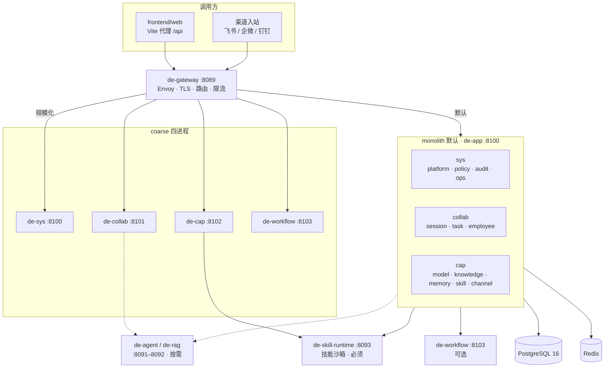
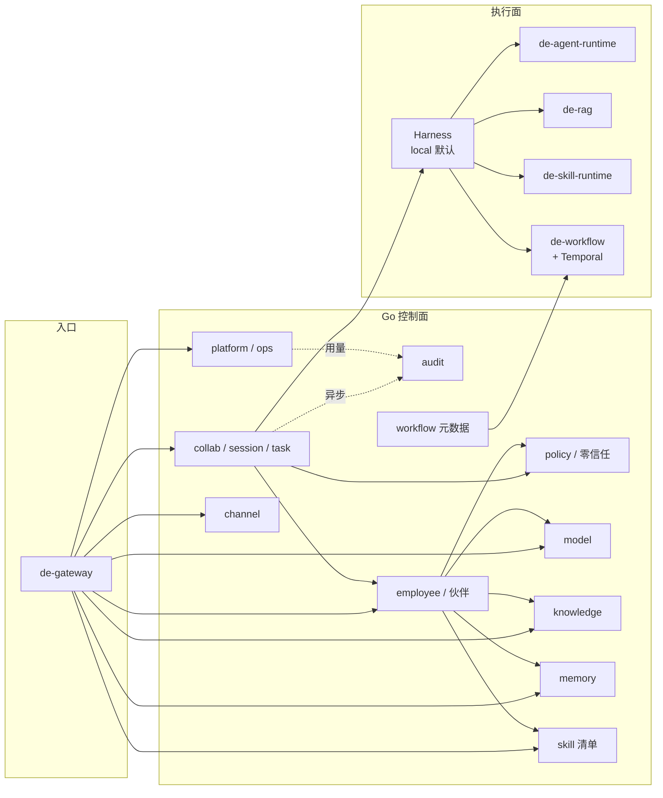
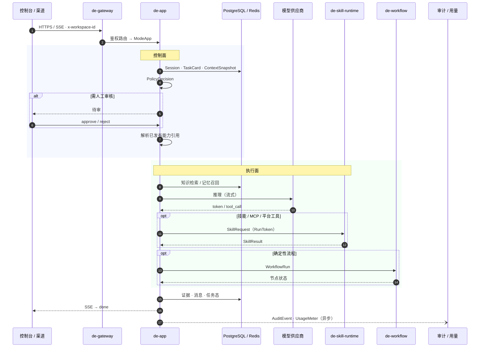

# Backend（控制面与执行面）

数字工作伙伴平台后端：Go 控制面（身份、策略、审计、资源编排）+ Python 执行面（Agent / RAG / Skill 沙箱）。

| 项 | 默认 |
|----|------|
| **本地拓扑** | **monolith**：`de-gateway:8089` → `de-app:8100` + `de-skill-runtime:8093` |
| **规模化对照** | coarse 四进程（sys / collab / cap / workflow） |
| **数据** | Docker Postgres 16 + Redis；禁止 Homebrew 抢占 `5432` |
| **环境** | `DE_ENV=development`（空库 hydrate，不灌 ACME seed） |

配套文档：

| 文档 | 用途 |
|------|------|
| [docs/后端架构规划.md](../docs/后端架构规划.md) | 服务边界与交付阶段 |
| [docs/后端微服务重构方案.md](../docs/后端微服务重构方案.md) | 粗粒度拆分演进 |
| [deploy/topology-split.md](deploy/topology-split.md) | monolith / coarse 切流 |
| [docs/环境与数据模式.md](../docs/环境与数据模式.md) | `DE_ENV`、Persist、办公开箱 |
| [api/routes.md](api/routes.md) | HTTP 路由契约 |

---

## 目录

- [架构总览](#架构总览)
- [模块交互图](#模块交互图)
- [数据流时序图](#数据流时序图)
- [部署单元](#部署单元)
- [代码结构](#代码结构)
- [快速开始](#快速开始)
- [Compose 与进程命令](#compose-与进程命令)
- [冷启动与办公开箱](#冷启动与办公开箱)
- [持久化与硬删除](#持久化与硬删除)
- [关键 API 摘要](#关键-api-摘要)
- [关键环境变量](#关键环境变量)
- [测试与冒烟](#测试与冒烟)

---

## 架构总览

**控制面管可信与编排，执行面跑推理与工具，网关统一入口。**  
`ServiceMode` 过滤路由；共享 PG KV 水合。monolith 下 `de-app` 以 `ModeApp` / `DomainAll` 吸收 sys + collab + cap。



文档分层对照：

| 层 | 含义 | 后端现状 |
|----|------|----------|
| **L0** | 控制面联调 | monolith + skill-runtime 已通 |
| **L1** | 领域契约 | 工作区隔离、审核、零信任语义已落地 |
| **L2** | 底座 | Temporal / Milvus / 真 gVisor 按阶段补齐 |

---

## 模块交互图

产品能力域在进程内（monolith）或进程间（coarse）的依赖关系：



| 域 | 职责 | monolith | coarse |
|----|------|----------|--------|
| **sys** | 工作区、设置、策略、审计、运营聚合 | de-app | de-sys（+ 可选独立 policy/audit） |
| **collab** | 会话、任务、审核、流式回合 | de-app | de-collab |
| **employee** | 岗位、装配、上岗 | de-app | de-collab |
| **cap** | 模型 / 知识 / 记忆 / 技能 / 渠道 | de-app | de-cap |
| **workflow** | 流程版本、试运行、Temporal | 可选 de-workflow | de-workflow |
| **skill-runtime** | 沙箱执行 | 必须独立 :8093 | 同左 |

已退役：`de-core`、细端口 `de-policy:8094` / `de-audit:8095`。独立切开：`DE_CROSSCUTTING_SPLIT=1` + `make run-policy` / `make run-audit`。

---

## 数据流时序图

专家协作发一条消息（monolith；高风险写操作可插入人工审核）：



`DE_RUNTIME_MODE=local`（默认）：进程内 Harness。  
`DE_RUNTIME_MODE=remote`：回合经 `de-agent-runtime` `POST /v1/run` SSE。  
完整扇出见 [docs/后端架构规划.md](../docs/后端架构规划.md) §3.3。

---

## 部署单元

| 单元 | 端口 | 说明 |
|------|------|------|
| **de-gateway** | 8089 | Envoy / `gateway-proxy-monolith.py`；健康检查 `/healthz` |
| **de-app** | 8100 | **monolith 默认**：sys + collab + cap |
| de-sys | 8100 | coarse：platform · ops；默认仍吸收 policy · audit |
| de-collab | 8101 | coarse：collab · employee |
| de-cap | 8102 | coarse：五中心能力 |
| de-workflow | 8103 | 流程 HTTP + Temporal Worker（可选） |
| de-policy | 8104 | 可选独立策略 |
| de-audit | 8105 | 可选独立审计读面 |
| **de-skill-runtime** | 8093 | 技能沙箱（**必须**） |
| de-agent / de-rag | 8091–8092 | coarse 或按需；monolith 默认不启 agent |

切流要点：

- collab/cap → `DE_POLICY_URL`（默认 `http://de-sys:8100` 的 `/v1/evaluate`）
- 审计写入各进程本地 sink；独立 de-audit 读 `audit.events`
- 多活最小集：`DE_REPLICA_MODE=standby` 拒写；优先 `DE_DATABASE_REPLICA_URL`（`make compose-up-replica` → `:5433`）

---

## 代码结构

```text
backend/
├── cmd/                       # 进程入口
│   ├── de-app/                # monolith 主进程（默认）
│   ├── de-sys/ · de-collab/ · de-cap/
│   ├── de-workflow/ · de-policy/ · de-audit/
│   └── de-local-llm/          # 本地模型辅助
├── builtin/                   # 出厂包（冷启动 EnsureBuiltin*）
│   ├── knowledge/office/      # kp.office.* 办公开箱知识
│   ├── skills/                # 岗位包 manifest（office / general …）
│   ├── workflows/             # wf.office.* + 部门 Certified + 高级库
│   └── scenarios/office/      # 知识·技能·流程三联
├── internal/                  # 业务实现（handler 仍集中于此）
│   ├── apprun/                # 进程启动、hydrate、ensure、Persist
│   ├── server/                # HTTP/Connect · ServiceMode 路由
│   ├── store/                 # 内存态 + PG 快照 / kernel 表
│   ├── policy/ · auth/        # 策略引擎、身份
│   ├── depolicy/ · deaudit/ · deworkflow/
│   ├── modelprov/ · vault/    # 模型供应商、凭据引用
│   ├── runtimeenv/            # 运行时环境
│   └── feishu/ · wecom/ · dingtalk/ · weixin/
├── api/                       # routes.md · proto · 契约说明
├── services/                  # 一部署单元一目录
│   ├── de-app/ · de-sys/ · de-collab/ · de-cap/
│   ├── de-gateway/ · de-workflow/
│   ├── de-skill-runtime/ · de-agent-runtime/ · de-rag/
│   └── de-policy/ · de-audit/
├── deploy/                    # compose · envoy · migrations · topology-split
├── infra/ · obs/              # 基础依赖与可观测
├── libs/ · pkg/ · gen/        # hexkit 等与 buf 生成代码
├── runtimes/                  # 测试辅助（非部署入口）
├── scripts/                   # purge-demo-seed-ids.sql 等
├── bin/                       # make build 产物（LaunchAgent 读取）
├── buf.yaml · buf.gen.yaml
├── go.mod
└── Makefile
```

| 路径 | 说明 |
|------|------|
| `cmd/de-app` + `internal/apprun` | 本地主路径入口与启动编排 |
| `internal/server` | 路由与领域 handler（六边形迁包进行中） |
| `builtin/` | 知识 / 技能 / 流程 / 场景出厂源 |
| `services/*/SERVICE.md` | 各部署单元说明 |
| `bin/de-*` | 改 Go 后须 `make build` 再 kickstart |

---

## 快速开始

本机联调前确保 Docker Postgres 16（勿用 Homebrew 占 `5432`）：

```bash
# 仓库根目录
bash scripts/dev-stack/ensure-docker-postgres.sh
# 或
cd backend && make infra-env
```

```bash
cd backend
make compose-up-monolith   # 或 make run
make smoke-monolith        # 经 :8089 验收
```

前端：

```env
VITE_USE_MOCK=false
VITE_API_BASE=
# Vite 默认代理 → http://127.0.0.1:8089
```

| 邮箱前缀 | 角色 | 说明 |
|---------|------|------|
| `admin@` | admin | 全量写；上架/上岗可自批 |
| `audit@` | auditor | 治理 / 审计只读 |
| 其他 | user | 写操作须管理员审批 |

演示 token（`mock-*-token`）需 `DE_ALLOW_DEMO_TOKEN=1` 或 `DE_BAN_MOCK_TOKEN=0`。LaunchAgent 默认 `DE_BAN_MOCK_TOKEN=1`。

改 Go 后：

```bash
make build
launchctl kickstart -k "gui/$(id -u)/com.digital-employee.dev-stack"
```

---

## Compose 与进程命令

| 命令 | 说明 |
|------|------|
| `make compose-up` | 仅 PG + Redis |
| `make compose-up-monolith` / `make run` | **主路径** |
| `make compose-up-monolith-workflow` | monolith + workflow |
| `make compose-up-coarse` | 四进程 coarse |
| `make compose-up-staging` | coarse + Dex + OPA + OpenSearch + obs |
| `make compose-up-replica` | 本机从库 `:5433` |
| `make infra-env` | 校验 / 拉起 Docker Postgres 16 |

单进程调试：

```bash
make run-app       # :8100 monolith · DE_ENV=development
make run-demo      # 内存 ACME seed，不写 PG
make run-dev       # infra-env + run-app
make run-sys       # :8100 sys only
make run-collab    # :8101
make run-cap       # :8102
make run-workflow  # :8103
make run-policy    # :8104
make run-audit     # :8105
make skill         # :8093 沙箱
```

网络：[`deploy/networks.md`](deploy/networks.md) · 拓扑：[`deploy/topology-split.md`](deploy/topology-split.md)。

---

## 冷启动与办公开箱

`apprun` 在非 `demo` 模式下 `store.NewEmpty()` + PG hydrate，**禁止**空库灌演示 seed。启动时 ensure：

| Ensure | 内容 |
|--------|------|
| `EnsureBuiltinSkillsReady` | 技能目录 + 各工作区 `autoInstall` 岗位包（`general` / `office`） |
| `EnsureBuiltinKnowledgeReady` | `kp.office.*` 知识包 → published |
| `EnsureBuiltinWorkflowsReady` | `wf.office.*` + 部门 Certified + 高级库；不覆盖 `wft-user-*` |
| 可选 `DE_ENSURE_GENERAL=1` | 补通用员工；办公助手 `de-office` 同路径 |

源码：`builtin/{knowledge,skills,workflows,scenarios}/`。说明见各子目录 README 与 [环境与数据模式](../docs/环境与数据模式.md)。

平台工具（`knowledge.retrieve` 等）为 Harness **内置**，不经岗位包安装。

---

## 持久化与硬删除

| 模式 | 行为 |
|------|------|
| `DE_ENV=demo` | 内存 store，不 Persist |
| `development`+ | PG hydrate；Upsert 写回；**硬删必须 `PersistDelete(Sync)`** |

多数集合是 Upsert：只改内存再 `Persist` **不会**删掉 PG 旧行。会话删除须 Sync 覆盖 sessions + conversations + messages + context_snapshots。知识 / 模型供应商 / 渠道 / 技能卸载等同理。

清理历史 ACME seed：

```bash
psql "$DE_DATABASE_URL" -f scripts/purge-demo-seed-ids.sql
# 或 make db-reset-dev（危险：丢全部数据）
```

---

## 关键 API 摘要

### 技能岗位包

| API | 说明 |
|-----|------|
| `GET /api/skills/packs` | 岗位包 + 当前工作区 `installed*` + `platformTools` |
| `POST /api/skills/apply-pack/:id` | 安装到当前工作区；`heavy-optin` 须审批单 |

### 专家协作（collab）

| 能力 | 路由 / 行为 |
|------|-------------|
| 会话 CRUD | `GET/POST/PATCH/DELETE /api/sessions`；非 admin 仅见本人；DELETE → PersistDelete |
| 对话详情 | `GET /api/conversations/:id` |
| 流式回合 | `POST …/stream`；结案/交接中拒绝写入 |
| 模式切换 | `PATCH /api/sessions/:id` → `sessionMode` |
| 单人审核 | `POST /api/actions/:id/approve`（发起人不可自批） |
| 附件 / 分享 | `/api/attachments` · `/api/share` |
| 限流 | 回合频控、`clientMsgId` 幂等；网关 Copilot 超时约 180s |

完整路由：[`api/routes.md`](api/routes.md)。

---

## 关键环境变量

| 变量 | 说明 |
|------|------|
| `DE_ENV` | `demo` \| `development`（默认）\| `staging` \| `production` |
| `DE_BAN_MOCK_TOKEN` / `DE_BAN_DEMO_TOKEN` | 禁止 mock token；**不**触发双人审批 |
| `DE_ALLOW_DEMO_TOKEN` | `development` 下显式允许演示 token |
| `DE_DATABASE_URL` / `DE_REDIS_URL` | PG / Redis |
| `DE_SYS_ADDR` / `DE_COLLAB_ADDR` / `DE_CAP_ADDR` / `DE_WORKFLOW_ADDR` / `DE_POLICY_ADDR` / `DE_AUDIT_ADDR` | 监听 |
| `DE_SERVICE` | `sys` / `collab` / `cap` / `workflow`；可选 `policy` / `audit` |
| `DE_POLICY_URL` | collab/cap → 策略 evaluate；sys 留空用本地 Engine |
| `DE_CROSSCUTTING_SPLIT` | `1` 时 de-sys 不再吸收 policy/audit |
| `DE_DATABASE_REPLICA_URL` | standby 从库；本机 `compose-up-replica` → `:5433` |
| `DE_AGENT_RUNTIME_URL` / `DE_RAG_URL` / `DE_SKILL_RUNTIME_URL` | 侧车 |
| `DE_RUNTIME_MODE` | `local`（默认）或 `remote` |
| `DE_RUNTIME_FAILOVER_LOCAL` | 非生产 remote 失败可回落 local |
| `DE_SKILL_TEST_SIM` | 开发默认开；生产强制关 |
| `DE_SKILL_RUN_SECRET` | RunToken HMAC |
| `DE_TEMPORAL_HOST` | 非空则流程走 Temporal；生产/staging 默认 fail-closed |
| `DE_MODEL_BUDGET_ENFORCE` | 用量硬门禁；生产默认开 |
| `DE_REPLICA_MODE` | `active`（默认）或 `standby` |
| `DE_INSTANCE_ID` | 实例标识 |
| `DE_EVAL_RECALL_MIN` / `DE_EVAL_SCORE_MIN` | 生产评测门禁 |
| `DE_ENSURE_GENERAL` | `1` 时非 demo 也可补通用员工 |
| `DE_WITH_WORKFLOW` / `DE_BUILTIN_WORKFLOWS_DIR` | 启 workflow / 覆盖流程包路径 |

---

## 测试与冒烟

```bash
make test && make test-python && make smoke-monolith
# coarse：make smoke-coarse
```

`make smoke-monolith` 经 `:8089` 探测 workspaces / skills / sessions / evaluate 等主路径。
