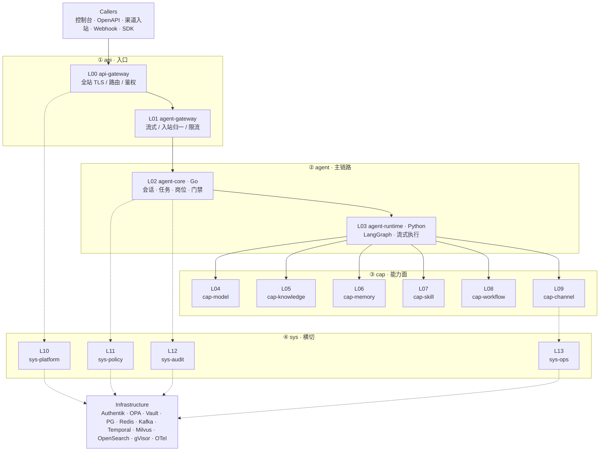
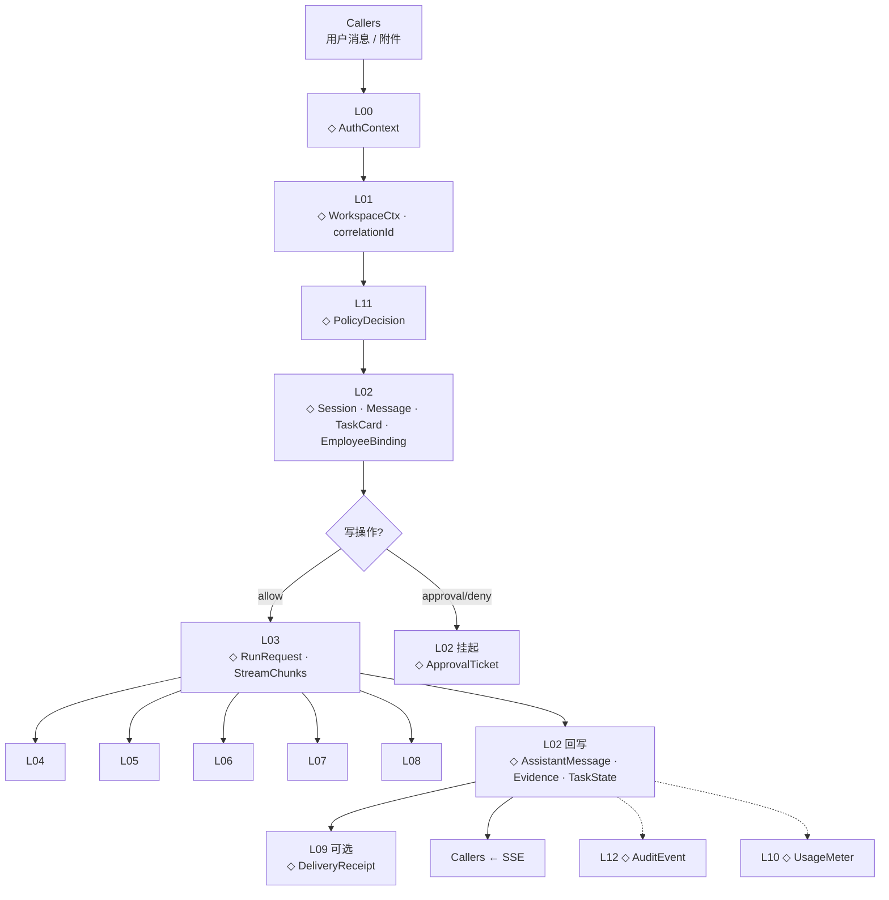
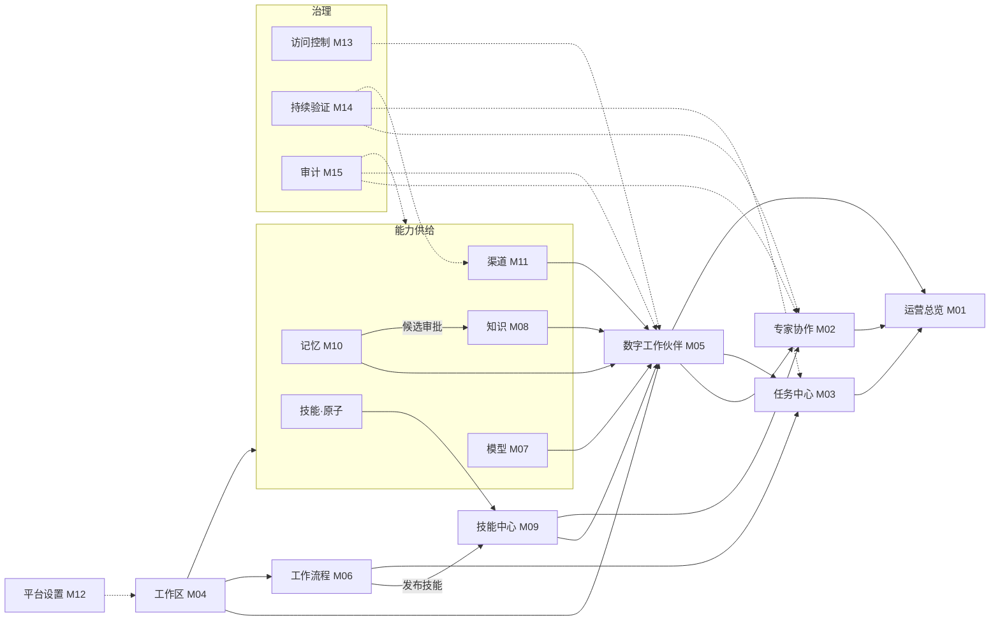

# 数字工作伙伴平台 · 后端架构规划

> **版本**：v1.8（2026-08-20）  
> **状态**：逻辑架构 + 工程契约基线；**本仓已交付粗粒度后端联调**（默认 `DE_ENV=development` + PG；演示见 `demo`）  
> **前提**：前端 L0 已交付；默认真实网关联调；Mock 为可选对照面  
> **契约真相源**：[`backend/api/routes.md`](../backend/api/routes.md) · [`backend/api/contract-gap.md`](../backend/api/contract-gap.md) ·（对照）`frontend/packages/api/src/mock.ts` · [ADR-013](./adr/ADR-013-agent-os-kernel.md) · [环境与数据模式](./环境与数据模式.md)  
> **配套产品文档**：[架构文档](./数字工作伙伴平台-架构文档.md) · [功能模块](./数字工作伙伴平台-功能模块文档.md) · [技术规格](./数字工作伙伴平台-技术规格说明.md)

本文为后端唯一规划入口：分层 / 服务 / 数据流 / 模块交互 / 实现清单 / **契约与安全基线**。

---

## 目录

| 章 | 内容 |
|---|---|
| [§1](#1-命名与双栈) | 逻辑层命名、Go/Python 分工 |
| [§2](#2-技术架构图) | 14 逻辑层拓扑与分层说明 |
| [§3](#3-服务拆分) | `de-*` 部署服务、基础设施、IDL |
| [§4](#4-用户数据流程图) | 使用时数据对象与旁路 |
| [§5](#5-功能模块交互图) | 产品模块依赖与禁止关系 |
| [§6](#6-实现清单与交付阶段) | 技术底座、横切能力、M01–M15、阶段 |
| [§7](#7-对照速查) | 模块 ↔ 层 ↔ 服务 |
| [§8](#8-硬约束与下一步) | 不可违背规则与建议启动项 |
| [§9](#9-api--服务--idl-映射) | Mock 路径归属与 protobuf 包 |
| [§10](#10-数据所有权) | 聚合根 · 谁写谁读 |
| [§11](#11-错误码与状态机) | `E_*` · PolicyDecision · 双签/发布 |
| [§12](#12-事件目录与横切工程) | Kafka · 服务鉴权 · 角色 · 环境晋升 · 遗留 API |
| [§13](#13-完备性状态) | 已补齐项 · 仍属 P2 的项 |

**Callers** = 控制台 · OpenAPI · 企微入站 · Webhook · SDK（外部调用方，≠ `cap-channel`）。

---

## 1. 命名与双栈

### 1.1 逻辑层命名（强制）

格式：`Lxx` + `{scope}-{name}`  
scope 封闭词表：`api` | `agent` | `cap` | `sys`

| 字段 | 规则 |
|---|---|
| **ID** | `L00`–`L13`，文档/IDL/日志一律使用 |
| **canonical** | 小写 kebab，唯一对外逻辑层名 |
| **name** | 单段英文；禁止再叠 `-plane`；模型路由勿称 `model-gateway` |
| **部署名** | 逻辑层 ≠ 进程；进程用 `de-*`（见 §3） |

| ID | canonical | 中文名 | 类型 | 栈 |
|---|---|---|---|---|
| L00 | api-gateway | API 网关 | 入口 | Envoy |
| L01 | agent-gateway | Agent 网关 | 入口 | Envoy / Go |
| L02 | agent-core | Agent 核心 | 主链路 | Go |
| L03 | agent-runtime | Agent 运行时 | 主链路 | Python |
| L04 | cap-model | 能力·模型 | 能力 | Go |
| L05 | cap-knowledge | 能力·知识 | 能力 | Go + Python |
| L06 | cap-memory | 能力·记忆 | 能力 | Go |
| L07 | cap-skill | 能力·技能 | 能力 | Go + Python |
| L08 | cap-workflow | 能力·工作流 | 能力 | Go |
| L09 | cap-channel | 能力·渠道 | 能力 | Go |
| L10 | sys-platform | 系统·平台 | 横切 | Go |
| L11 | sys-policy | 系统·策略 | 横切 | Go |
| L12 | sys-audit | 系统·审计 | 横切 | Go |
| L13 | sys-ops | 系统·运营 | 横切 | Go |

**废弃旧名**：`edge-gateway` / `platform-gateway` → `api-gateway`；`model-gateway` → `cap-model`；`*-plane` → `cap-*` / `sys-*`；`tool-plane` → `cap-skill`。

### 1.2 双栈分工

| 栈 | 职责 | 禁止 |
|---|---|---|
| **Go** | API、RBAC、工作区、审计、双签、Temporal Worker、元数据 | 不做 Agent/RAG 编排 |
| **Python** | LangGraph、RAG、Skill/MCP 沙箱执行 | 不做租户/权限/计费真相源 |
| **互通** | Connect-RPC（一套 IDL） | 禁止双份 REST 方言 |

---

## 2. 技术架构图

### 2.1 逻辑分层总图

> **读图**：实线 = 主链路请求/调用；虚线 = 横切依赖（策略 · 审计 · 平台 · 运营）。  
> scope：`api` · `agent` · `cap` · `sys`（共 14 层）。



```text
┌─────────────────────────────────────────────────────────────────────────┐
│  Callers                                                                │
│  控制台 · OpenAPI · 企微入站 · Webhook · SDK                         │
└─────────────────────────────────┬───────────────────────────────────────┘
                                  │
                                  ▼
┌─ ① api · 入口 ──────────────────────────────────────────────────────────┐
│  L00 api-gateway  ──►  L01 agent-gateway                                │
│  全站入口 / TLS          流式 · 入站归一 · correlationId                 │
└─────────────────────────────┬───────────────────────────────────────────┘
                              │
                              ▼
┌─ ② agent · 主链路 ──────────────────────────────────────────────────────┐
│  L02 agent-core · Go  ──►  L03 agent-runtime · Python                   │
│  会话 · 任务 · 岗位          LangGraph · 工具选择 · 流式                 │
└───────┬─────────────────────────────┬───────────────────────────────────┘
        │ 虚线横切                    │ 实线扇出
        ▼                             ▼
┌─ ④ sys · 横切 ──────┐    ┌─ ③ cap · 能力面 ────────────────────────────┐
│ L10 sys-platform    │    │ L04 model │ L05 knowledge │ L06 memory      │
│ L11 sys-policy      │    │ L07 skill │ L08 workflow  │ L09 channel     │
│ L12 sys-audit       │    └─────────────────────────────────────────────┘
│ L13 sys-ops         │
└──────────┬──────────┘
           ▼
┌─ Infrastructure ────────────────────────────────────────────────────────┐
│ Authentik · OPA · Vault · PG · Redis · Kafka · Temporal                 │
│ Milvus · OpenSearch · gVisor · OTel                                     │
└─────────────────────────────────────────────────────────────────────────┘
```

### 2.2 各层职责

#### 入口 · api

| 层 | 职责 | 不做 |
|---|---|---|
| **L00 api-gateway** | 全站 TLS、路由、通用鉴权/限流；分发 `/api/*` | 业务逻辑、推理、策略计算 |
| **L01 agent-gateway** | SSE/流式、渠道入站归一、会话限流、注入 WorkspaceCtx + correlationId | 岗位装配、模型路由真相源、推理 |

L00 与 L01 可同 Envoy、**不同路由组**；逻辑必须分开。`L00 ≠ L01 ≠ L04`。

#### 主链路 · agent

| 层 | 职责 | 服务 |
|---|---|---|
| **L02 agent-core** | 会话/任务、岗位装配解析、调 L11 门禁、调度 L03、回写证据 | `de-collab` + `de-employee` |
| **L03 agent-runtime** | LangGraph 循环、技能选择、流式；按已发布引用调 L04–L09 | `de-agent-runtime` |

#### 能力面 · cap

| 层 | 职责 | 服务 |
|---|---|---|
| **L04 cap-model** | Provider、路由发布/回滚、预算、出境 | `de-model` |
| **L05 cap-knowledge** | 知识控制面 + RAG 执行 | `de-knowledge` + `de-rag` |
| **L06 cap-memory** | 三层记忆；长期 → 知识候选 | `de-memory` |
| **L07 cap-skill** | 技能治理 + gVisor 沙箱执行 | `de-skill` + `de-skill-runtime` |
| **L08 cap-workflow** | 流程版本 + Temporal；可发布为技能 | `de-workflow` |
| **L09 cap-channel** | 入出站、降级、死信 | `de-channel` |

#### 横切 · sys

| 层 | 职责 | 服务 |
|---|---|---|
| **L10 sys-platform** | 租户、工作区、设置、API Key、配额 | `de-platform` |
| **L11 sys-policy** | RBAC/SoD、双签、零信任 | `de-policy` + OPA |
| **L12 sys-audit** | 审计、故事线、脱敏导出 | `de-audit` |
| **L13 sys-ops** | 运营总览只读聚合 | `de-ops` |

### 2.3 关键调用链（层视角）

专家协作发消息（或渠道入站归一后）的同步主路径 + 异步收尾：

```text
Callers（用户消息 / 渠道事件）
  │
  ├─①─► L00 api-gateway          鉴权 → AuthContext
  ├─②─► L01 agent-gateway        注入 WorkspaceCtx · correlationId · 限流
  ├─③─► L11 sys-policy           准入 / 零信任 → PolicyDecision
  ├─④─► L02 agent-core           落 Session · Message · TaskCard
  │                                解析 EmployeeBinding（已发布能力引用）
  ├─⑤─► L11 sys-policy           ［条件］生产写：双签 / SoD；deny→挂起
  ├─⑥─► L03 agent-runtime        RunRequest → LangGraph 循环
  │         │
  │         ├─► L04 cap-model         模型路由 · TokenUsage
  │         ├─► L05 cap-knowledge     RAG · RetrievalHits
  │         ├─► L06 cap-memory        MemoryBundle
  │         ├─► L07 cap-skill         SkillResult（沙箱）
  │         └─► L08 cap-workflow      ［可选］WorkflowRunId
  │
  ├─⑦─► L02 agent-core           回写 AssistantMessage · Evidence · TaskState
  ├─⑧─► L09 cap-channel          ［可选］出站 → DeliveryReceipt / 死信
  │
  ├─⑨··► L12 sys-audit           异步 AuditEvent（correlationId）
  └─⑩··► L10 sys-platform        异步 UsageMeter / 配额扣减
```

| 阶段 | 同步/异步 | 失败时 |
|---|---|---|
| ①–③ | 同步 | 401/403/429，不进 L02 |
| ④–⑤ | 同步 | 审批挂起或拒绝，可无 L03 |
| ⑥ | 同步流式 | 错误 chunk + L02 记失败态 |
| ⑦–⑧ | 同步 | 出站失败进死信，会话仍可 done |
| ⑨–⑩ | 异步 | 不影响用户 SSE 完成 |

---

## 3. 服务拆分

### 3.1 拆分原则

| # | 原则 |
|---|---|
| 1 | Go / Python **分进程**；Connect-RPC 互通 |
| 2 | 控制面（元数据/发布/审批）在 Go；长推理/RAG/沙箱在 Python |
| 3 | 策略、双签、审计与业务 CRUD 解耦 |
| 4 | 模型/知识/技能/记忆/渠道分控制面，各有发布真相源 |
| 5 | 先粗后细：进程可合并，**代码边界先按服务切开** |
| 6 | 不对齐「一产品模块一微服务」 |

### 3.2 目标服务清单

```text
                         Callers
                            │
                            ▼
                     ┌─────────────┐
                     │ de-gateway  │  Envoy · TLS · 路由 · 限流
                     └──────┬──────┘
            ┌───────────────┼───────────────┐
            ▼               ▼               ▼
     ┌────────────┐  ┌────────────┐  ┌──────────────────┐
     │ Go 地基    │  │ Go 业务    │  │ Python 运行时     │
     │ platform   │  │ collab     │  │ agent-runtime    │
     │ policy     │  │ employee   │  │ rag              │
     │ audit      │  │ model      │  │ skill-runtime    │
     └────────────┘  │ knowledge  │  │   （gVisor）      │
                     │ skill      │  └──────────────────┘
                     │ memory     │
                     │ channel    │
                     │ workflow   │
                     │ ops        │
                     └────────────┘
```

| 分组 | 服务名 | 栈 | 职责摘要 | 模块 | 阶段 | 逻辑层 |
|---|---|---|---|---|---|---|
| **入口** | de-gateway | Envoy | 统一入口、TLS、路由、限流；可含 `/agent/*` | — | A | L00·L01 |
| **地基** | de-platform | Go | 租户、工作区、设置、API Key、配额 | M04 M12 | A | L10 |
| | de-policy | Go | RBAC/SoD、双签、零信任 evaluate | M13 M14 | A | L11 |
| | de-audit | Go | 审计写入、故事线、脱敏导出 | M15 | A | L12 |
| **编排** | de-collab | Go | 会话/消息元数据、任务生命周期 | M02 M03 | B | L02 |
| | de-employee | Go | 岗位、装配、评测、上岗 | M05 | B | L02 |
| **能力** | de-model | Go | 供应商、路由、预算、出境 | M07 | C | L04 |
| | de-knowledge | Go | 知识资产控制面、版本发布 | M08 | C | L05 |
| | de-memory | Go | 记忆策略与知识候选 | M10 | D | L06 |
| | de-skill | Go | 技能清单、集成、运行治理 | M09 | D | L07 |
| | de-workflow | Go | 流程版本 + Temporal Worker | M06 | D | L08 |
| | de-channel | Go | 渠道接入、投递、死信 | M11 | D | L09 |
| **运营** | de-ops | Go | 运营总览只读聚合 | M01 | E | L13 |
| **AI** | de-agent-runtime | Python | LangGraph、流式、工具编排 | M02/M05 | C | L03 |
| | de-rag | Python | 切片、Embedding、Milvus、Rerank | M08 | C | L05 |
| | de-skill-runtime | Python+gVisor | Skill/MCP 沙箱执行 | M09 | D | L07 |

> **规模**：gateway + 15 业务服务 = 16 部署单元（目标态）。阶段 A–C 可按 §3.4 合并进程，边界不混。

### 3.3 服务调用（关键路径）

专家协作发一条消息时的服务跳转（与 §2.3 层调用一一对应）：

```text
Callers
  │  HTTPS / SSE
  ▼
de-gateway ────────────────────────────┐
  │ ① 鉴权、路由                         │
  ▼                                    │
de-collab ──◇ Session / TaskCard       │
  │ ② 落会话与任务卡                     │
  ▼                                    │
de-policy ──◇ PolicyDecision           │  同步
  │ ③ 准入；写操作则双签门禁             │
  ▼                                    │
de-employee ──◇ EmployeeBinding        │
  │ ④ 解析已发布能力引用                 │
  ▼                                    │
de-model ──◇ ModelRoute                │
  │ ⑤ 解析路由（也可由 runtime 直调）    │
  ▼                                    │
de-agent-runtime                       │
  │ ⑥ LangGraph                        │
  ├─► de-rag              RetrievalHits│
  ├─► de-skill-runtime    SkillResult  │
  ├─► de-workflow         WorkflowRun  │［可选］
  │                                    │
  ▼                                    │
de-collab ──◇ Evidence / TaskState     │
  │ ⑦ 回写证据与任务态                   │
  ├─► de-channel          Delivery     │［可选出站］
  │                                    │
  ├··► de-audit           AuditEvent   │  异步 Kafka
  └··► de-platform        UsageMeter   │  异步计量
```

| 步 | 服务 | 同步 | 说明 |
|---|---|---|---|
| ① | de-gateway | ✓ | 无业务逻辑 |
| ②–⑤ | collab → policy → employee → model | ✓ | Go 控制面 |
| ⑥ | agent-runtime + rag/skill-runtime/workflow | ✓ 流式 | Python / Temporal |
| ⑦ | collab · channel | ✓ | 回写与可选出站 |
| 收尾 | audit · platform | 异步 | 不阻塞 SSE done |

> **补全**：⑥ 中 runtime 亦应按需调用 `de-memory`（L06）；上表为最短关键路径，完整扇出见 §2.3。

### 3.4 阶段合并（进程）

| 阶段 | 进程包 | 内含边界 | 当前落地 |
|---|---|---|---|
| A | de-gateway + **de-app**（monolith）或 de-sys（coarse） | platform · policy · audit | **已落地** |
| B | de-app / de-collab | collab · employee | **已落地**（monolith 合一） |
| C | de-app / de-cap + AI | model · knowledge · memory · skill · channel | **已落地**（monolith 合一） |
| D | 按隔离拆分 | workflow · skill-runtime · agent · rag | workflow/skill-runtime **已落地** |
| E | ops；audit 查询扩缩 | 运营与合规导出 | 部分落地 |

> 历史阶段 A 曾称 `de-core`，已退役。本地默认 **monolith**（`make compose-up-monolith`）。

**永不混部**：skill-runtime · agent-runtime · rag · audit 查询面。

### 3.5 基础设施

| 组件 | 角色 |
|---|---|
| Authentik | IdP（OIDC + MFA） |
| OPA | 策略引擎（de-policy） |
| Vault | 凭据引用与轮转 |
| PostgreSQL 16 | Go 主库（可共库分 schema） |
| Redis | 会话/配额/缓存 |
| Kafka | 审计、异步、渠道 |
| Temporal Server | 工作流（Worker 在 de-workflow） |
| Milvus / OpenSearch / Nebula / S3 | 向量、日志、图谱、对象 |
| gVisor | skill-runtime |
| Prometheus · OTel · Grafana | 可观测 |
| K8s · Istio · ArgoCD | 编排（P2） |

### 3.6 仓库与 IDL

| 约定 | 说明 |
|---|---|
| 形态 | `backend/cmd`+`internal`（控制面）+ `backend/runtimes/`（执行面）+ 共享 `api/proto/` |
| 协议 | Connect-RPC；对外 REST 兼容对齐 Mock `/api/*` |
| 工作区 | gateway/platform 注入；下游强制校验 |
| 发布引用 | employee 只存已发布版本引用 |
| 审计 | 业务 → Kafka → de-audit；禁止绕过 |

---

## 4. 用户数据流程图

### 4.1 读图符号

| 符号 | 含义 |
|---|---|
| 实线 → | 同步 / 流式主路径 |
| 虚线 ··> | 异步（Kafka / 计量 / 审计） |
| ◇ | 该跳关键数据对象 |

### 4.2 专家协作主路径



| 步 | 层 | 输出关键数据 |
|---|---|---|
| 1 | Callers | 请求体 |
| 2 | L00 | AuthContext |
| 3 | L01 | WorkspaceCtx · correlationId |
| 4 | L11 | PolicyDecision |
| 5 | L02 | Session · UserMessage · TaskCard · EmployeeBinding |
| 6 | L11 条件 | DualSign / ApprovalTicket 或放行 |
| 7 | L03 | RunRequest → StreamChunks |
| 8 | L04–L08 | ModelRoute · RetrievalHits · MemoryBundle · SkillResult · WorkflowRunId |
| 9 | L02 回写 | AssistantMessage · EvidencePack · TaskState |
| 10 | L09 可选 | DeliveryReceipt |
| 11 | L12 异步 | AuditEvent |
| 12 | L10 异步 | UsageMeter |

### 4.3 流式时序（SSE）

```text
Callers          L01              L02              L03             L04…L08
  │                │                │                │                │
  │ POST /sse      │                │                │                │
  │───────────────►│                │                │                │
  │                │ PolicyDecision │                │                │
  │                │───────────────►│                │                │
  │                │                │ 落 Session/任务 │                │
  │                │                │ RunRequest     │                │
  │                │                │───────────────►│                │
  │                │                │                │ model/rag/skill│
  │                │                │                │───────────────►│
  │                │                │                │◄── hits/result─│
  │◄══ event:delta ║════════════════║════════════════║══ token chunk ─│
  │◄══ event:tool  ║════════════════║════════════════║══ tool event ──│
  │                │                │                │ final          │
  │                │                │◄───────────────│                │
  │                │                │ 回写 Evidence  │                │
  │◄══ event:done  ║════════════════║                │                │
  │                │                │·· AuditEvent ·············► L12 │
  │                │                │·· UsageMeter ·············► L10 │
```

| SSE 事件（建议） | 方向 | 含义 |
|---|---|---|
| `delta` | Runtime → Callers | 文本/token 增量 |
| `tool` | Runtime → Callers | 工具/技能调用起止与摘要 |
| `evidence` | L02 → Callers | ［可选］引用片段预览 |
| `done` | L02 → Callers | 本轮结束；含 messageId / taskId |
| `error` | 任一层 → Callers | 可恢复或终止；须带 correlationId |

**约定**：首包前完成 ①–⑤（鉴权/策略/落库）；`done` 之后才异步投递审计与计量；中断连接时 L02 将 TaskState 标为 `interrupted`。

### 4.4 旁路

| 场景 | 路径 |
|---|---|
| 渠道入站 | 外部 → L09 IngressEvent → L01 归一 → 自 L11 进主路径 |
| 任务治理 | Callers → L00 → L02 ↔ L11；重试再进 L03 |
| 配置面 | Callers → L00 → 对应 cap/sys **不经 L03** → L11 → L12 |

配置面落库示例：工作区切换 → L10；上岗 → L02+L11；模型/知识/技能发布 → L04/L05/L07+L11；运营只读 → L13；审计导出 → L12。

### 4.5 核心数据对象

| 对象 | 真相源 | 生命周期 |
|---|---|---|
| AuthContext | L00 / IdP | 请求级 |
| WorkspaceCtx | L10 定义，L01 注入 | 请求级 |
| correlationId | L01 | 全链路 |
| PolicyDecision | L11 | 请求级 |
| Session / Message / Task* / EmployeeBinding | L02 | 持久 |
| RunRequest / StreamChunks | L02→L03 / L03→Callers | 运行级 |
| ModelRoute / TokenUsage | L04 | 版本持久 + 事件 |
| RetrievalHits / MemoryBundle / SkillResult | L05/L06/L07 | 运行级 |
| WorkflowRunId | L08 | Temporal + L02 |
| DeliveryReceipt | L09 | 持久 |
| AuditEvent / UsageMeter | L12 / L10 | 持久 / 聚合 |

### 4.6 数据硬约束

1. WorkspaceCtx 服务端注入，查询键含工作区。  
2. L03 不做 Session/Task/配额真相源。  
3. 凭据仅 Vault 引用，不进 Message/Runtime 日志。  
4. Memory 只产知识候选，审批后进 L05。  
5. correlationId 必须写入 L12。

---

## 5. 功能模块交互图

### 5.1 产品 IA

与前端侧栏一致；括号内为模块 ID / 主逻辑层。

```text
┌─ 经营 ────────────────────────────────────────────────────────────┐
│  运营总览 (M01 · L13)                                              │
└────────────────────────────────────────────────────────────────────┘

┌─ 协作 ────────────────────────────────────────────────────────────┐
│  专家协作 (M02 · L01/L02/L03)  →  任务中心 (M03 · L02)             │
└────────────────────────────────────────────────────────────────────┘

┌─ 编排 ────────────────────────────────────────────────────────────┐
│  数字工作伙伴 (M05 · L02)  →  工作流程 (M06 · L08)                     │
└────────────────────────────────────────────────────────────────────┘

┌─ 能力（分控制面，只供给已发布版本）────────────────────────────────┐
│  模型服务 (M07 · L04)                                              │
│  知识中心 (M08 · L05)                                              │
│  技能中心 (M09 · L07)  ← 工作流程「发布技能」汇入                    │
│  记忆中心 (M10 · L06)  → 知识候选（须审批）→ 知识中心               │
│  消息渠道 (M11 · L09)                                              │
└────────────────────────────────────────────────────────────────────┘

┌─ 账号 / 治理 ─────────────────────────────────────────────────────┐
│  工作区 (M04 · L10)                                                │
│  平台设置 (M12 · L10)                                              │
│     ├─ 访问控制 (M13 · L11)                                        │
│     ├─ 持续验证 (M14 · L11)                                        │
│     └─ 审计中心 (M15 · L12)     ※ auditor 可独立只读入口            │
└────────────────────────────────────────────────────────────────────┘
```

| 区域 | 用户主任务 | 写路径特点 |
|---|---|---|
| 经营 | 看状态与跳转处置 | 只读 |
| 协作 | 对话、处置任务 | 高频；受 L11 门禁 |
| 编排 | 上岗、编流程 | 上岗/发布须双签 |
| 能力 | 接入、发布、治理资产 | 各控制面独立发布 |
| 账号/治理 | 域隔离、授权、证据 | 审计只读 |

### 5.2 依赖主链（单向）

原则：下游只引用**已发布**资产；数字工作伙伴是唯一岗位主体；流程须「发布技能」后进技能中心再装配；治理横切不生产能力。



### 5.3 关系类型

| 关系 | 含义 | 示例 |
|---|---|---|
| 发布 | 正式版本供下游引用 | 模型 → 已发布路由 |
| 发布技能 | 流程进入技能中心 | 工作流程 → 技能 |
| 装配 | 工作伙伴引用已发布版本 | 数字工作伙伴 ← 能力 |
| 调用 | 经在岗员工使用 | 专家协作 → 员工 → 技能 |
| 授权/双签 | 上岗与生产写 | 访问控制 → 上岗 |
| 运行验证 | 请求级策略 | 持续验证 → 协作/出站 |
| 审计 | 只读证据 | 写路径 → 审计中心 |
| 晋升 | 记忆候选 → 知识 | 须审批 |
| 度量 | 只读聚合 | → 运营总览 |

### 5.4 禁止关系

| 禁止 | 原因 |
|---|---|
| 协作直接编流程/注册技能 | 只调用在岗员工 |
| 员工改模型/知识本体 | 只装配版本 |
| 未发布流程被聊天调用 | 须经技能中心 |
| 运营总览配置写/审批写 | 只读跳转 |
| 审计中心任何配置写 | auditor 只读 |
| 工作区重复建 RBAC/零信任/审计 UI | 治理在平台设置 |

### 5.5 运行时（模块视角）

一次「人对在岗数字工作伙伴发消息」时，产品模块如何协作（不含配置发布）：

```text
 Callers
    │
    ▼
┌──────────────┐     调用在岗      ┌──────────────────┐
│ 专家协作 M02 │ ───────────────► │ 数字工作伙伴 M05     │
│ 会话 · 证据  │ ◄── 流式回复 ─── │ 岗位边界 · 装配表 │
└──────┬───────┘                  └────────┬─────────┘
       │ 同步任务卡                         │ 仅引用已发布版本
       ▼                                   ▼
┌──────────────┐         ┌──── cap 已发布资产 ─────────────────────┐
│ 任务中心 M03 │         │ 模型 M07 · 知识 M08 · 技能 M09          │
│ 看板 · 接管  │         │ 记忆 M10 · 渠道 M11                      │
└──────────────┘         │ 流程 M06 ─发布技能► 技能 M09 再被装配    │
                         └──────────────────┬──────────────────────┘
                                            │ 运行时调用
                ┌───────────────────────────┼───────────────────────┐
                ▼                           ▼                       ▼
         推理 / RAG / 技能            流程实例（可选）         渠道出站（可选）
                │                           │                       │
                └───────────────────────────┴───────────────────────┘
                                            │
                         ┌──────────────────┼──────────────────┐
                         ▼                  ▼                  ▼
                  持续验证 M14         访问控制 M13        审计中心 M15
                  （请求级决策）       （双签 / SoD）       （correlationId）
                                            │
                                            ▼
                                     运营总览 M01（只读度量）
```

| 模块 | 运行时角色 | 不做什么 |
|---|---|---|
| M02 专家协作 | 人机会话入口、展示证据 | 不编流程、不注册技能 |
| M05 数字工作伙伴 | 岗位主体；持有已发布装配 | 不改能力本体 |
| M03 任务中心 | 异步治理与人工接管 | 不直接调模型 |
| M06→M09 | 长流程经「发布技能」后可被调用 | 未发布不可被聊天直调 |
| M07–M11 | 被装配后的能力供给 | 不决定谁上岗 |
| M13/M14 | 门禁与双签 | 不生产业务资产 |
| M15 / M01 | 证据与度量 | 无写真相源 |

---

## 6. 实现清单与交付阶段

### 6.1 技术底座（L2 选型）

| 层 | 选型 | 优先级 |
|---|---|---|
| 协议 / 网关 | Connect-RPC · Envoy | P0 |
| 业务 API | Go 1.22+ · Gin | P0 |
| AI 运行时 | Python 3.12 · LangGraph · LlamaIndex | P0 |
| 工作流 | Temporal | P1 |
| 主库 | PostgreSQL 16 | P0 |
| 向量 / 检索 | Milvus · OpenSearch | P1 |
| 消息 | Kafka KRaft | P1 |
| 缓存 | Redis Cluster | P0 |
| 对象存储 | S3 / MinIO | P1 |
| 身份 / 策略 / 密钥 | Authentik · OPA · Vault | P0 |
| 沙箱 | gVisor | P1 |
| 可观测 | Prometheus · OTel · Grafana | P1 |
| 编排 | K8s · Istio · ArgoCD | P2 |

### 6.2 横切平台能力（先于堆业务）

| 能力 | 技术 | 优先级 |
|---|---|---|
| 身份与会话 | Go + Authentik | P0 |
| 工作区隔离 | Go + PG | P0 |
| RBAC / SoD | Go + OPA | P0 |
| 受控双签 | Go | P0 |
| 零信任决策 | Go + OPA | P0 |
| 审计流水 | Go → OpenSearch | P0 |
| 凭据治理 | Go + Vault | P0 |
| 用量计费 | Go + Redis | P1 |

### 6.3 业务模块 M01–M15

| ID | 模块 | 栈 | 后端职责 | Mock 契约 | 优先级 |
|---|---|---|---|---|---|
| M01 | 运营总览 | Go | live-aggregate KPI/待办/成本诚实空态 | `/api/home/*` · operations（`ops_aggregate`） | P1 |
| M02 | 专家协作 | Go+Py | 会话流式、工具/RAG、交接、双签 | `/api/copilot/*` | **P0** |
| M03 | 任务中心 | Go | 生命周期、审批、接管、重试 | `/api/tasks/*` | **P0** |
| M04 | 工作区 | Go | CRUD、环境、配额、冻结移交 | `/api/workspaces/*` | **P0** |
| M05 | 数字工作伙伴 | Go+Py | 岗位、装配、评测、上岗 | `/api/digital-employees/*`（页面 `/partners`） | **P0** |
| M06 | 工作流程 | Go+Temporal+Py | 模板、版本、试运行、发布技能 | `/api/workflows/*` | P1 |
| M07 | 模型服务 | Go | 供应商、路由、预算 | `/api/models/*` | **P0** |
| M08 | 知识中心 | Go+Py | 资产、加工、RAG、候选入库 | `/api/knowledge/*` | **P0** |
| M09 | 技能中心 | Go+Py | 清单、集成、沙箱治理 | `/api/skills/*` | P1 |
| M10 | 记忆中心 | Go+Py | 三层记忆、候选、策略 | `/api/memory/*` | P1 |
| M11 | 消息渠道 | Go | 接入、路由、死信 | `/api/channels/*` | P1 |
| M12 | 平台设置 | Go | 租户、备份、API Key、套餐 | `/api/settings/*` | P1 |
| M13 | 访问控制 | Go | 授权、复核、发布审批 | `/api/access/*` | **P0** |
| M14 | 持续验证 | Go | 策略、evaluate、临时授权 | `/api/zero-trust/*` | **P0** |
| M15 | 审计中心 | Go | 故事线、脱敏导出 | `/api/audit-center/*` | **P0** |

**API 分组**：平台地基 `auth/workspaces/access/zero-trust/audit-center/settings` · 协作编排 `copilot/tasks/digital-employees/workflows` · 能力 `models/knowledge/skills/memory/channels` · 运营 `home/operations/billing`。

### 6.4 交付阶段与验收

| 阶段 | 范围 | 验收 |
|---|---|---|
| **A 地基** | 网关 + 身份 + 工作区 + RBAC + 审计骨架 + PG/Redis/Vault | 可登录、切工作区、写审计；`VITE_USE_MOCK=false` |
| **B 编排** | 数字工作伙伴 + 任务 + 双签 + 访问控制/零信任 | 可上岗、可处置任务 |
| **C 对话** | 专家协作流式 + 模型路由 + RAG 最小闭环 | 可协作、可检索、可计费 |
| **D 扩展** | Temporal + 技能沙箱 + 记忆 + 渠道 | 可编排发布、可出站 |
| **E 运营** | 运营聚合、用量、备份、等保加固 | 可运营、可测评 |

---

## 7. 对照速查

| 产品模块 | 逻辑主层 | 主服务 | 交互角色 |
|---|---|---|---|
| M01 运营总览 | L13 | de-ops | 经营聚合（只读） |
| M02 专家协作 | L01·L02·L03 | collab + agent-runtime | 协作入口 |
| M03 任务中心 | L02 | de-collab | 异步治理 |
| M04 工作区 | L10 | de-platform | 域边界 |
| M05 数字工作伙伴 | L02 | de-employee | 岗位主体 |
| M06 工作流程 | L08 | de-workflow | 编排→发布技能 |
| M07 模型服务 | L04 | de-model | 能力供给 |
| M08 知识中心 | L05 | knowledge + rag | 能力供给 |
| M09 技能中心 | L07 | skill + skill-runtime | 技能汇聚 |
| M10 记忆中心 | L06 | de-memory | 候选→知识 |
| M11 消息渠道 | L09 | de-channel | 入出站 |
| M12 平台设置 | L10 | de-platform | 租户壳 |
| M13 访问控制 | L11 | de-policy | 治理 |
| M14 持续验证 | L11 | de-policy | 治理 |
| M15 审计中心 | L12 | de-audit | 治理 |

---

## 8. 硬约束与下一步

### 8.1 硬约束

1. 业务真相源在 Go；AI 编排只在 L03 / rag / skill-runtime。  
2. 工作区/租户服务端推导，不信任客户端伪造。  
3. 凭据仅引用/掩码；已发布路由/策略有依赖保护。  
4. 生产写：身份绑定双签 + SoD；auditor 只读。  
5. 数字工作伙伴只引用**已发布**模型/知识/技能/渠道版本。  
6. 长期记忆 → 知识候选 → 审核后进知识资产。  
7. Skill/MCP/不可信代码必须 gVisor（或等价）。  
8. `api-gateway` ≠ `agent-gateway` ≠ `cap-model`。

### 8.2 建议下一步

1. **已完成（阶段 0）**：冻结为 [ADR-013](./adr/ADR-013-agent-os-kernel.md)。IDL：`de.common.v1`（Envelope / ContextSnapshot / PolicyDecision）、`CollabService.ReplayTurn`、`RuntimeService.Run`。契约测试锁定 `sessionMode`、四态决策与 `E_*`。  
2. **已完成（阶段 1）**：飞书 `chatId` Session Routing、ContextSnapshot 落盘、只读 Replay（REST + Connect）、生产关闭 mock 身份与 runtime stub。禁止另起平行 REST DTO。  
3. **已完成（阶段 2）**：`copilotStream` 经 `runRuntimeTurn` 进入 Loop；`DE_RUNTIME_MODE=local|remote` 双跑；remote 消费 `de-agent-runtime` `POST /v1/run` SSE；失败映射 `E_RUNTIME_UNAVAILABLE`；生产 RAG 关键词降级、关闭技能 sim。完整 ReAct 工具循环仍在 local Go Harness。  
4. **已完成（阶段 3）**：企微入站对齐同一 Envelope / Session Routing / `copilotStream`（失败进 DLQ）；已发布且试运行成功的流程可发布为技能；生产 Temporal 配置后不可达 fail-closed；上岗/路由/知识生产双人审批；生产不回落明文 ModelSecrets；用量硬门禁默认开；运营总览补 pending 诚实计数。  
5. **已完成（阶段 4）**：钉钉入站对齐同一 Envelope；生产高风险会签（上岗/知识/受限路由）；流程技能生产 SoD 批准后才可装配；知识/上岗评测集门禁；自进化批准只出 draft；`DE_REPLICA_MODE=standby` 拒写。Slack 仍为投递渠道而非入站 Caller。邮件/短信/电话不在渠道目录。  
6. 前端专家协作只消费 `StreamEvent` 词表（`stage|delta|tool|route|evidence|done|error`）。

### 8.3 可视化 Canvas（可选）

| 图 | 文件 |
|---|---|
| 技术架构 | `agent-architecture-diagram.canvas.tsx` |
| 用户数据流 | `user-data-flow.canvas.tsx` |
| 模块交互 | `module-relations.canvas.tsx` |
| 摘要入口 | `architecture-overview.canvas.tsx` |

---

## 9. API · 服务 · IDL 映射

> 原则：对外 REST 路径对齐联调后端与 Mock；对内 Connect-RPC 包名 `de.<domain>.v1`。gateway 做路径 → 服务路由。  
> **运营聚合**：`/api/home/extra`、`/api/home/kpis`、`/api/operations/overview` 由 `ops_aggregate` 提供 `live-aggregate`——与员工/任务等实体同源；无数则为 0/空；成本仅在 UsageMeters 有计量时给出金额，禁止演示种子充数。

### 9.1 路径前缀 → 服务 → protobuf 包

| Mock / 对外前缀 | 主服务 | IDL 包（建议） | 阶段 |
|---|---|---|---|
| `/api/auth/*` | de-platform（会话桥）+ Authentik | `de.platform.v1` | A |
| `/api/workspaces*` · `/api/workspace-switch-history` | de-platform | `de.platform.v1` | A |
| `/api/settings/*` · tenant / billing / apikeys | de-platform | `de.platform.v1` | A/E |
| `/api/access/*` · `/api/release-approvals` | de-policy | `de.policy.v1` | A |
| `/api/zero-trust/*` | de-policy | `de.policy.v1` | A |
| `/api/audit-center/*` | de-audit | `de.audit.v1` | A |
| `/api/copilot/*` · sessions / messages（流式） | de-collab + de-agent-runtime | `de.collab.v1` · `de.runtime.v1` | B/C |
| `/api/tasks/*` | de-collab | `de.collab.v1` | B |
| `/api/digital-employees*` · `digital-employee-*` | de-employee | `de.employee.v1` | B |
| `/api/models/*` · providers | de-model | `de.model.v1` | C |
| `/api/knowledge/*` | de-knowledge；retrieve → de-rag | `de.knowledge.v1` · `de.rag.v1` | C |
| `/api/memory/*` | de-memory | `de.memory.v1` | D |
| `/api/skills/*` · `/api/workflow-skills` | de-skill | `de.skill.v1` | D |
| `/api/workflows*` · orchestration / runs / kpi | de-workflow | `de.workflow.v1` | D |
| `/api/channels*` · delivery | de-channel | `de.channel.v1` | D |
| `/api/home/*` · `/api/operations/overview` | de-ops | `de.ops.v1` | E |
| `/api/agents*` · `/api/evaluations`（遗留） | 见 [§12.5](#125-遗留-apiagents) | — | 降级 |

### 9.2 流式接口约定

| 能力 | 对外 | 对内 |
|---|---|---|
| 专家协作发消息 | `POST /api/copilot/sessions/{id}/messages:stream`（SSE） | Connect `de.collab.v1.CollabService/StreamTurn`；内核 Loop → `de.runtime.v1.RuntimeService/Run` |
| 回合复盘 | 阶段 1：`ReplayTurn` / REST 投影 | Connect `de.collab.v1.CollabService/ReplayTurn`（只读，禁止再调模型） |
| 网关 | L01 保持 SSE 扇出；不缓冲全量再转发 | runtime 事件映射为 §4.3 与 ADR-013 的 `stage/delta/tool/route/evidence/done/error` |

### 9.3 IDL 落地顺序

1. `platform` · `policy` · `audit`（阶段 A）  
2. `collab` · `employee`（阶段 B）  
3. `model` · `knowledge` · `runtime` · `rag`（阶段 C）  
4. 其余 cap 包（阶段 D）· `ops`（阶段 E）

---

## 10. 数据所有权

### 10.1 聚合根归属（谁写）

| 聚合根 / 主表 | 写服务（唯一） | 读方 | 存储 |
|---|---|---|---|
| Tenant · Workspace · Membership · Quota · ApiKey | de-platform | 全服务（缓存 WorkspaceCtx） | PG |
| AccessGrant · ReleaseApproval · DualSignChallenge | de-policy | collab/employee/gateway | PG |
| ZeroTrustPolicy · TemporaryAuth · PolicyDecision 日志 | de-policy | audit（副本事件） | PG |
| AuditEvent · EvidenceExport | de-audit | 控制台只读 | PG + OpenSearch |
| Session · Message · Task · TaskTransition | de-collab | ops（投影） | PG |
| DigitalEmployee · EmployeeBinding · EmployeeRelease | de-employee | collab/runtime（快照） | PG |
| ModelProvider · ModelRouteVersion · BudgetLedger | de-model | runtime | PG；密钥仅 Vault 引用 |
| KnowledgeAsset · KnowledgeVersion · Citation | de-knowledge | rag（只读已发布） | PG + S3 |
| VectorIndex / ChunkEmbedding | de-rag | runtime | Milvus |
| MemoryRecord · MemoryCandidate · MemoryPolicy | de-memory | runtime/knowledge（候选审批后） | PG |
| SkillManifest · SkillBinding · WorkflowSkill | de-skill | runtime/employee | PG |
| SkillExecutionLog（沙箱） | de-skill-runtime | skill/audit | PG（摘要）+ 对象 |
| WorkflowDef · WorkflowVersion · WorkflowRun | de-workflow | collab/ops | PG + Temporal |
| ChannelAccount · DeliveryPolicy · DeliveryReceipt · DeadLetter | de-channel | ops/audit | PG + Kafka |
| OpsSnapshot / 物化 KPI | de-ops | 控制台 | PG 只读视图 / 缓存 |

**规则**：跨服务禁止直写他库；要变更外域聚合必须发命令/事件，由归属服务执行。

### 10.2 运行快照

`RunRequest` 携带 **EmployeeBinding 已发布版本号快照**（model/knowledge/skill/channel/memory 策略 ID）。运行中即使上游发布新版本，本轮仍用快照，保证可复现审计。

---

## 11. 错误码与状态机

### 11.1 错误响应约定

```json
{
  "code": "E_WORKSPACE_SCOPE",
  "message": "无权访问其他工作区资源",
  "correlationId": "…",
  "details": {}
}
```

HTTP 映射：`4xx` 客户端/权限；`409` 冲突/依赖保护；`429` 限流；`503` 下游不可用。`code` 稳定，供前端与 Mock 对齐。

### 11.2 核心错误码（与 Mock `E_*` 对齐，摘录）

| 码 | 场景 | HTTP |
|---|---|---|
| `E_AUDITOR_READ_ONLY` | auditor 非 GET | 403 |
| `E_ROLE_FORBIDDEN` | 角色无权 | 403 |
| `E_ADMIN_REQUIRED` | 需管理员 | 403 |
| `E_WORKSPACE_SCOPE` / `E_WORKSPACE_NOT_FOUND` / `E_WORKSPACE_WRITE_FORBIDDEN` | 工作区 | 403/404 |
| `E_WORKSPACE_IN_USE` | 冻结/归档有活跃绑定 | 409 |
| `E_ACCESS_*` / `E_SOD_SELF_APPROVAL` / `E_ACCESS_SELF_ESCALATION` | 授权与 SoD | 403 |
| `E_RELEASE_*` / `E_RELEASE_REQUEST_REQUIRED` | 发布审批 | 403/400 |
| `E_ZERO_TRUST_DENY` / `E_ZERO_TRUST_*` | 零信任 | 403/400 |
| `E_TEMPORARY_AUTH_*` | 临时授权 | 400/403 |
| `E_MODEL_*` / `E_EGRESS_BLOCKED` / `E_BUDGET_EXCEEDED` | 模型路由 | 400/403 |
| `E_CHANNEL_*` / `E_DELIVERY_*` | 渠道投递 | 400/403 |
| `E_MEMORY_*` | 记忆写入/候选 | 400/403 |
| `E_DIGITAL_EMPLOYEE_*` | 数字工作伙伴配置/上岗 | 400/403/404 |
| `E_TASK_SCOPE` / `E_TASK_OWNER_SCOPE` | 任务 | 403 |
| `E_AUDIT_READ_FORBIDDEN` / `E_AUDIT_EXPORT_FORBIDDEN` | 审计 | 403 |
| `E_SESSION_CLOSED` / `E_SESSION_HANDOFF` | 会话已结案 / 人工交接写暂停 | 403 |
| `E_REPLAY_NOT_FOUND` / `E_SNAPSHOT_NOT_FOUND` | 回合复盘 / ContextSnapshot 缺失 | 404 |
| `E_CHANNEL_THREAD_UNBOUND` | 入站 thread 未绑定会话 | 400 |
| `E_RUNTIME_UNAVAILABLE` | Agent Runtime 不可用 | 503 |
| `E_CONTEXT_INVALID` | ContextSnapshot / 窗口非法 | 400 |
| `E_IDENTITY_MOCK_FORBIDDEN` | 生产拒绝 mock 身份头 | 401 |

完整枚举以实现时从 `mock.ts` 抽取生成 `errors.proto` / 共享 Go 包为准；**禁止**各服务自造同义不同码。

### 11.3 PolicyDecision 状态

```text
evaluate(resource, action, ctx)
  → allow              继续
  → mask               继续但对响应/检索结果脱敏（obligations）
  → approval_required  阻塞写路径 → 创建 ApprovalTicket / DualSignChallenge
  → deny               立即失败 E_ZERO_TRUST_DENY
```

临时授权（TemporaryAuth）可在有效期内将特定 `(subject, resource, action)` 从 deny/approval 降为 allow；生产环境临时授权须双人审批（Mock：`E_TEMPORARY_AUTH_PRODUCTION_REQUIRES_DUAL_APPROVAL`）。

### 11.4 双签 / 发布状态机

```text
草稿 draft
  │ submit（提交人 A）
  ▼
待审 pending_approval ── A 不可自批（E_SOD_SELF_APPROVAL）
  │ approve（审批人 B ≠ A）
  ▼
已发布 published ── 可被 EmployeeBinding 引用
  │
  ├─ deprecate → deprecated（仍可读历史，不可新装配）
  └─ 新变更 → 生成新版本 draft（旧 published 保持直到切换）
```

适用：数字工作伙伴上岗/受控配置变更、模型路由发布、知识/技能/渠道生产发布、`release-approvals` 流程。

### 11.5 任务状态（摘要）

与 Mock 任务域对齐，至少支持：`pending` → `in_progress` → `blocked` / `waiting_approval` → `done` / `failed` / `interrupted`（SSE 断开）。转移经 `de-collab`，高风险动作先 `de-policy`。

---

## 12. 事件目录与横切工程

### 12.1 Kafka Topic（建议）

| Topic | 生产者 | 消费者 | 载荷要点 |
|---|---|---|---|
| `de.audit.v1` | 各写服务 | de-audit | correlationId · actor · workspace · action · resource · result · ts |
| `de.usage.v1` | model/runtime/channel | de-platform | token/席位/投递计数 · workspace · routeId |
| `de.channel.outbound.v1` | controller | de-channel workers | OutboundMessage |
| `de.channel.deadletter.v1` | de-channel | ops/audit | 失败投递 |
| `de.knowledge.index.v1` | de-knowledge | de-rag | 需重建索引的 versionId |
| `de.memory.candidate.v1` | de-memory | knowledge UI / 审批流 | 知识候选创建/更新 |
| `de.workflow.run.v1` | de-workflow | collab/ops | run 状态变更 |

事件必须带 `tenantId` · `workspaceId` · `correlationId`；审计 Topic 开启受限 ACL，仅 audit 服务可写 OpenSearch。

### 12.2 服务间鉴权

| 跳转 | 机制 |
|---|---|
| Callers → gateway | OIDC Access Token（Authentik）或 API Key（platform 签发，Vault 存哈希） |
| gateway → Go 服务 | 内网 mTLS（Istio）+ 转发 `x-de-user` / `x-de-workspace` **仅作缓存提示**；服务端须验签/ introspection 或信任网格身份并查会话 |
| Go → Python runtime/rag/skill-runtime | mTLS + 短期 **RunToken**（由 collab/employee 签发，含 binding 快照哈希、TTL≤15min） |
| 服务 → Vault / OPA | AppRole / 工作负载身份；禁止把用户 JWT 直接当 Vault 凭证 |

**禁止**：Python 服务直连业务主库写 Session/Task；禁止客户端伪照 Workspace 头绕过。

### 12.3 角色强制点（后端）

| 角色 | 允许 | 强制拒绝 |
|---|---|---|
| **user** | 协作、任务、已授权员工、工作流（非生产直发）、知识/技能/记忆（范围内） | `/api/models*` `/api/channels*` `/api/access*` 管理写；生产直发（须 release 申请） |
| **admin** | 上表 + 模型/渠道/工作区/治理写、平台设置 | 不能绕过 SoD 自批；不能改自己的 access grant 提权 |
| **auditor** | 持续验证事件、审计中心、脱敏导出 | **全部非 GET** → `E_AUDITOR_READ_ONLY`；不参与双签签发 |

权限点（示例，与 Mock 一致）：`model.read/write` · `channel.read/write` · `access.read/write` · `release.approve` · `audit.read/export`。L11 为唯一授权真相源。

### 12.4 环境晋升与依赖保护

```text
sandbox 试运行 → staging 验证 → production 发布（须 release-approval + 双签）
```

| 规则 | 说明 |
|---|---|
| 引用完整性 | 删除/停用已被 EmployeeBinding 引用的 published 版本 → `409` 依赖保护 |
| 基线策略 | 租户零信任 baseline 不可停用（`E_ZERO_TRUST_BASELINE_LOCKED`） |
| 数据分级 | `restricted` 禁止出境模型与外部 webhook/sms（`E_EGRESS_BLOCKED` / `E_DELIVERY_CLASSIFICATION_BLOCKED`） |
| 工作区冻结 | 有 active binding 时冻结须 `force` + 原因审计 |

### 12.5 遗留 `/api/agents`

| 项 | 约定 |
|---|---|
| 定位 | 技术运行/评测遗留面；**产品主路径为 `/api/digital-employees*`**（控制台页面 `/partners`） |
| 后端现状 | 已实现 **只读投影**（见 `handlers_b.go` Deprecated 注释）；不新建独立 `de-agents` |
| 兼容 | 继续只读代理到 employee/runtime；响应可标 `Deprecation` |
| 禁止 | 新功能不得只挂在 `/api/agents`；控制台主路径不得回退依赖该前缀 |

### 12.6 合规与多活（指针）

数值与拓扑以配套文档为准，本文不重复展开：

| 主题 | 参见 |
|---|---|
| 多区域 cn-east/south、RTO/RPO | [架构文档](./数字工作伙伴平台-架构文档.md) §5 |
| 等保 3 + ISO、ADR 锁定 | [技术规格](./数字工作伙伴平台-技术规格说明.md) §13、架构文档 §7 |
| 备份恢复（M12） | de-platform 实现；生产恢复走审批语义 |

---

## 13. 完备性状态

### 13.1 结论（v1.7）

| 维度 | 评级 | 说明 |
|---|---|---|
| 逻辑架构 | **充分** | §1–§7 |
| 工程契约基线 | **已冻结（阶段 0）** | §9–§12 + [ADR-013](./adr/ADR-013-agent-os-kernel.md)；`de.common.v1` / `Runtime.Run` / `ReplayTurn` |
| 运维数值与多活细规 | **仍弱（P2）** | 见下表；以技术规格/架构文档为准 |
| 接口字段级对齐 | **进行中** | 见 `contract-gap.md`；枚举线格式由 `pkg/contract` 与前端 `agent-os.ts` 锁定 |

### 13.2 仍属 P2（可后置）

| 项 | 说明 |
|---|---|
| SLO / 容量 / 限流配额数值 | 上线前运维基线 |
| OTel 指标与 trace 命名全集 | 实现时按服务模板铺开 |
| 契约测试流水线细节 | Mock 录制 → CI 符合性 |
| 全量 `E_*` 自动生成 | 从 mock.ts 抽码表脚本 |

### 13.3 落地阅读顺序

1. §1–§3、§8 → 边界与阶段 A  
2. §9–§11 → 开 IDL 与 de-app（monolith）/ 四进程切流  
3. §12 → 网格鉴权、角色、事件总线  
4. §6.4 阶段推进；P2 与多活按配套文档执行  

---

## 修订记录

| 版本 | 日期 | 说明 |
|---|---|---|
| v1.0 | 2026-08-01 | 分册：总览 / 分层 / 数据流 / 服务 / 模块清单 |
| v1.1 | 2026-08-01 | 五册合并；L00=`api-gateway`；Callers 命名 |
| v1.2 | 2026-08-01 | 完备性审查缺口清单 |
| **v1.3** | **2026-08-01** | **补齐 P0/P1：API 映射 · 数据所有权 · 错误/状态机 · 事件/安全/角色/晋升/遗留 API；更新完备性结论** |
| **v1.4** | **2026-08-01** | **已交付：`backend/` de-core（A–E 关键路径，内存态）+ Python runtime/rag/skill stub；联调见 `backend/README.md`** |
| **v1.5** | **2026-08-01** | **契约对齐：Mock 路径（model-providers / channel-control / conversations / DE lifecycle 等）+ `TestPageSmokeGETs`；见 `backend/api/contract-gap.md`** |
| **v1.6** | **2026-08-17** | **页眉纠正「后端已交付」；契约真相源改为 routes/contract-gap；ops live-aggregate 诚实语义；`/api/agents` 现状改为已只读投影；页面路由对齐 `/partners`** |
| **v1.7** | **2026-08-18** | **阶段 0：ADR-013 冻结 Envelope/Snapshot/Run/Replay 与 E_*；契约测试对齐 sessionMode / PolicyDecision** |
| **v1.8** | **2026-08-19** | **monolith 默认（de-app:8100 + de-skill:8093）；内置技能包迁移；文档与 smoke-monolith 对齐** |
