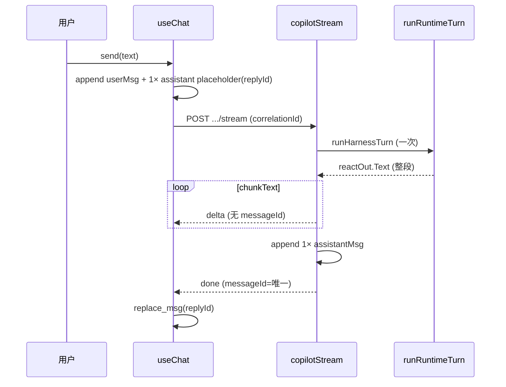
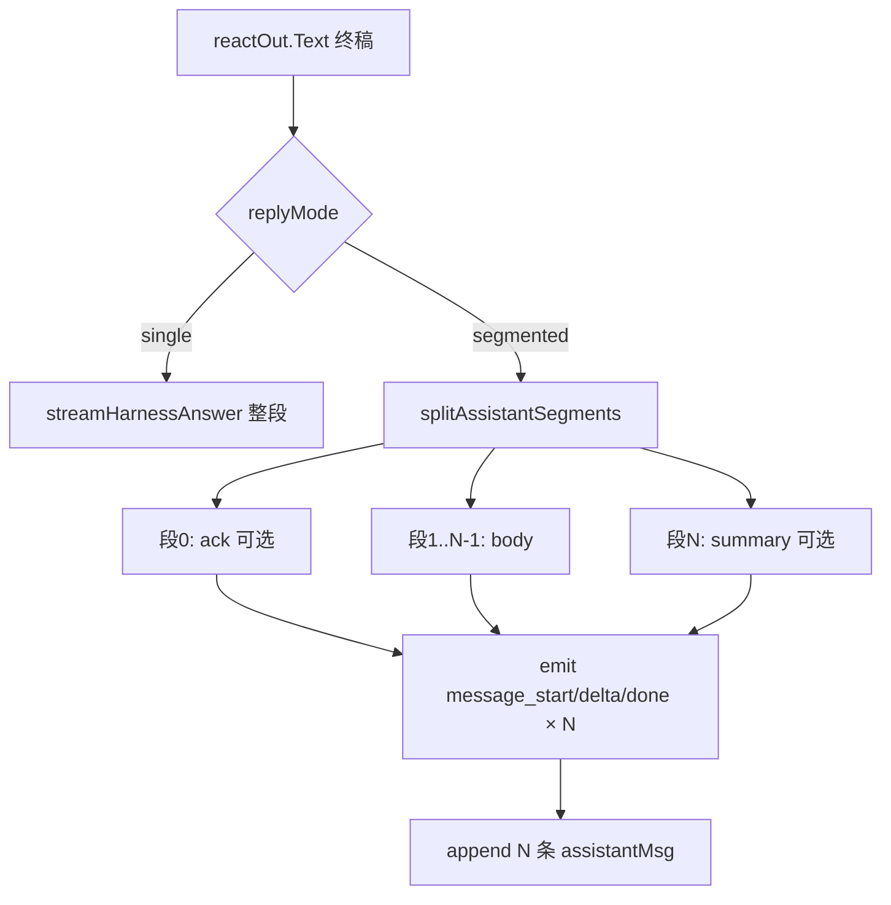
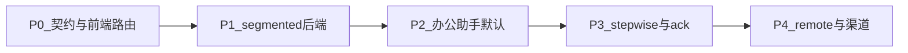

# 实施方案：专家协作「一问多回复」

> **状态**：已实施（P0–P4 主干）  
> **日期**：2026-08-22  
> **对应**：[ADR-013 流式事件词表](./adr/ADR-013-agent-os-kernel.md) · `copilotStream` / `useChat` · 办公助手 `de-office`

## 1. 背景与目标

### 1.1 产品诉求

目标体验（参考办公助手对话）：

| 场景 | 期望气泡数 | 示例 |
|------|-----------|------|
| 简单问答 | 1–2 | 能力介绍 + 反问关注点 |
| 自我介绍 | 2 | 身份说明 + 语气偏好 |
| 文档整理 | 3+ | 「收到」→ 整理结果 → 需求分析 |
| 多步任务 | N | 每步简短播报 + 最终结论 |

核心：**同一轮用户提问（同一 `correlationId`）下，出现多条 `assistant` 气泡**，而非单条长文或仅推理面板内的阶段信息。

### 1.2 技术目标

| # | 目标 | 验收 |
|---|------|------|
| G1 | SSE / Connect 契约支持「多 messageId 段」 | 旧客户端单气泡降级 |
| G2 | 后端按段流式 + 按段落库 | 刷新后气泡数不变 |
| G3 | 前端按 `messageId` 路由多 placeholder | 流式时每段独立打字效果 |
| G4 | 可配置 `replyMode` | 办公助手默认分段，SRE 等可保持单条 |
| G5 | Replay / 幂等 / 记忆写入语义正确 | 见 §8 |

### 1.3 非目标（本期不做）

- 用户侧「合并相邻 assistant 气泡」编辑
- 跨 `correlationId` 的自动续聊
- 渠道（飞书/企微）独立排版（仅保证 Envelope 字段可扩展）

---

## 2. 现状（As-Is）

### 2.1 数据流



### 2.2 关键约束

| 层级 | 文件 | 行为 |
|------|------|------|
| 后端落库 | `handlers_c.go` | 每轮 `append` **一条** `assistantMsg` |
| 流式 | `streamHarnessAnswer` | 多 `delta`，同一文本流 |
| 契约 | `pkg/contract/wire.go` | `stage\|delta\|tool\|route\|evidence\|done\|error` |
| 前端 | `useChat.startBackendStream` | 单 `replyId`；`plan/agent/reflect` → `reasoningSteps` |
| UI | `Copilot.tsx` `MessageBubble` | `messages.map` 一条一泡，**不拆 content** |
| 例外 | `authorization` 事件 | 另一 `messageId` 可 `replace_msg` 追加审批泡 |

### 2.3 与截图差距

截图中的「收到 → 执行 → 分析」**不是**现有 `reasoningSteps` 的 UI 表现；要实现需正式的多消息协议，不能仅靠 Prompt 让模型写多段落（仍落一条气泡）。

---

## 3. 目标架构（To-Be）

### 3.1 回复模式 `replyMode`

在 **Stream 请求** 与 **数字员工 runtime 配置** 两处可读（请求优先）：

```ts
type ReplyMode =
  | 'single'      // 默认：与现网一致
  | 'segmented'   // 终稿按规则拆成 2–N 条气泡
  | 'stepwise';   // Harness 阶段各发一条（计划/步骤/结论）
```

| 模式 | 触发点 | 典型员工 |
|------|--------|----------|
| `single` | 无拆段 | SRE、合规（长报告单泡） |
| `segmented` | `streamHarnessAnswer` 前拆 `[]string` | `de-office` 办公助手 |
| `stepwise` | plan / multi-agent / 技能多步 | 文档整理、复杂任务 |

**解析顺序**：`POST body.replyMode` → `employee.runtime.replyMode` → 默认 `single`。

### 3.2 事件词表扩展（ADR-013 增补）

在现有词表上 **新增**（不修改既有事件语义）：

| 事件 type | stage | 含义 |
|-----------|-------|------|
| `message_start` | `runtime` | 新 assistant 段开始 |
| `message_delta` | `runtime` | 段内 token 增量（见兼容策略） |
| `message_done` | `runtime` | 段结束，可带段级 metadata |
| `delta` | `runtime` | **保留**；无 `messageId` 时写入默认段 |
| `done` | `done` | 整轮结束；增加 `messageIds[]` |

#### `message_start` payload

```json
{
  "type": "message_start",
  "stage": "runtime",
  "correlationId": "corr_xxx",
  "messageId": "msg_seg_2",
  "segmentIndex": 1,
  "segmentTotal": 3,
  "replyMode": "segmented",
  "kind": "ack | body | summary | step",
  "title": "可选：步骤标题"
}
```

#### `message_delta` / 兼容 `delta`

```json
{
  "type": "message_delta",
  "messageId": "msg_seg_2",
  "text": "我先读一下文档…",
  "modelId": "sonnet-4"
}
```

**兼容规则**：

- 新客户端：优先处理带 `messageId` 的 `message_delta`；若无则回退 `delta` + 默认 `replyId`。
- 旧客户端：忽略 `message_start` / `message_done`；无 `messageId` 的 `delta` 行为不变。
- 服务端在 `replyMode=single` 时 **不发送** 新事件，仅发传统 `delta`。

#### `message_done` payload

```json
{
  "type": "message_done",
  "messageId": "msg_seg_2",
  "segmentIndex": 1,
  "toolCalls": [],
  "citations": [],
  "moderated": false
}
```

#### `done` payload（扩展）

```json
{
  "type": "done",
  "ok": true,
  "correlationId": "corr_xxx",
  "messageId": "msg_seg_0",
  "messageIds": ["msg_seg_0", "msg_seg_1", "msg_seg_2"],
  "replyMode": "segmented",
  "segmentCount": 3
}
```

`messageId` 保留为 **第一段**（或唯一段）id，兼容现有 `useChat` 的 `serverMsgId` 逻辑。

### 3.3 消息落库模型

每条 assistant 消息增加可选字段：

| 字段 | 类型 | 说明 |
|------|------|------|
| `correlationId` | string | 已有；整轮共享 |
| `segmentIndex` | int | `0..N-1`；`single` 模式为 `0` 或省略 |
| `segmentKind` | string | `ack` / `body` / `summary` / `step` / `auth` |
| `replyMode` | string | 生成时模式快照 |
| `parentMessageId` | string | 可选；`stepwise` 下指上一段 |

**同轮多条消息**：`Messages[cid]` 内连续 `append` N 条 `role=assistant`，共享 `correlationId`，`segmentIndex` 递增。

**推理轨迹**：`reasoningSteps` / `toolCalls` / `citations` 默认挂在 **最后一段**（`segmentIndex` 最大）或 `stepwise` 下按段拆分（见 §5.3）。

---

## 4. 分段策略

### 4.1 `segmented` 拆段管线



#### `splitAssistantSegments(text, opts) []Segment`

优先级（可组合，配置开关）：

1. **结构化输出**（推荐，办公场景）  
   - 扩展 `structured_output` 或 Harness 要求模型输出 JSON：  
     `{"segments":[{"kind":"ack","text":"..."},{"kind":"body","text":"..."}]}`  
   - 解析失败 → 降级策略 2。

2. **显式分隔符**  
   - 模型 Prompt：`用户可见回复若有多段，段间单独一行写 ---`  
   - `strings.Split(text, "\n---\n")`，过滤空段，每段 `strings.TrimSpace`。

3. **段落启发式**（兜底）  
   - 按 `\n\n` 拆段；合并短段（`< minRunes`，默认 40）到上一段；  
   - 最多 `maxSegments`（默认 5），超出则最后一段合并余文。

4. **即时 ack**（降低首字等待）  
   - 在 Runtime **开始前**（RAG/路由之后）若 `replyMode=segmented` 且用户消息含附件或长度 > 阈值：  
   - 先发 `message_start` + 固定模板 ack（「我先看一下…」）或 LLM 8 token 短确认；  
   - 主回答作为后续段。

### 4.2 `stepwise` 钩子

| Harness 位置 | 文件 | 段 kind | 内容 |
|--------------|------|---------|------|
| Plan 就绪 | `copilot_plan.go` | `step` | `计划共 N 步：…` |
| 每步 `answer` 完成 | `copilot_plan.go` | `step` | 步骤标题 + 摘要 |
| Multi-agent 委派/回执 | `copilot_multi.go` | `step` | `委派 {name}：{preview}` |
| Reflect 修订后 | `copilot_reflect.go` | `body` | 仅最终修订文（可选不单独成泡） |
| 聚合终稿 | `streamHarnessAnswer` | `summary` | 最终结论 |

`stepwise` 与 `segmented` **可叠加**：stepwise 产生多段后，单段内仍可按 `\n\n` 再拆（默认关闭）。

### 4.3 Prompt 补充（办公助手）

在 `buildCopilotSystemPromptWithEffort` 中，当 `replyMode != single` 追加：

```
若本轮需多次面向用户的短回复，请用单独一行的 --- 分隔各段；
第一段可先简短确认已理解任务（不超过 2 句），再展开后续段。
```

`de-office` 默认 `employee.runtime.replyMode = "segmented"`（`builtin_general.go`）。

---

## 5. 后端实施

### 5.1 契约与 Proto

| 步骤 | 文件 | 改动 |
|------|------|------|
| B1 | `backend/pkg/contract/wire.go` | 常量 `StreamMessageStart`, `StreamMessageDelta`, `StreamMessageDone`；扩展 `StreamEventTypes` |
| B2 | `backend/api/proto/de/common/v1/common.proto` | `StreamEventType` 枚举新增三项（若已有 reserved 则追加） |
| B3 | `backend/api/proto/de/collab/v1/collab.proto` | `StreamTurnEvent` 增加 `message_id`, `segment_index` 字段；`StreamTurnRequest` 增加 `reply_mode` |
| B4 | `docs/adr/ADR-013-agent-os-kernel.md` | §4 增补事件表 + 兼容说明 |

生成：`cd backend && make proto`（或仓库既定 buf 命令）。

### 5.2 核心模块：`copilot_segments.go`（新文件）

```go
type AssistantSegment struct {
    ID           string
    Index        int
    Kind         string // ack|body|summary|step
    Content      string
    ToolCalls    []map[string]any
    Citations    []map[string]any
}

func resolveReplyMode(body map[string]any, emp map[string]any) string
func splitAssistantSegments(text string, cfg segmentConfig) []AssistantSegment
func emitSegmentStream(emit reactEmitFunc, segs []AssistantSegment, modelID, corr, replyMode string)
func assistantMessagesFromSegments(segs []AssistantSegment, corr, replyMode string, sharedMeta map[string]any) []map[string]any
```

`emitSegmentStream` 对每个 segment：

1. `message_start`
2. `chunkText` → `message_delta`（或带 `messageId` 的 `delta`）
3. `message_done`

### 5.3 改造 `handlers_c.go`

**流式路径**（`replyMode != single`）：

1. 解析 `replyMode`（body + employee）。
2. `runRuntimeTurn` 不变，仍一次调用。
3. 终稿 `full` 经 safety 后：
   - `segments := buildSegments(full, reactOut, replyMode, userMsg, attachmentIDs)`
   - 若 `len(segments)==1` 且模式为 `segmented`，仍走原 `streamHarnessAnswer`（避免无意义拆泡）。
   - 否则 `emitSegmentStream` **在落库前** 已发完 SSE（或边 emit 边落库，见下）。
4. 落库：`for _, msg := range assistantMessagesFromSegments(...) { append }`
5. `touchSessionLocked` 的 `preview` 取 **最后一段** 前 80 字。
6. `done` 携带 `messageIds`。

**即时 ack**（可选 flag `DE_COPILOT_SEGMENT_ACK=1`）：

- 在 `emit stage runtime running` 之后、`runRuntimeTurn` 之前，若满足附件/长度条件，先 `emitSegmentStream` 仅 ack 段并 **立即 append 落库 ack 消息**（用户刷新也能看到「收到了」）。

**计量** `recordUsageWS`：仍按 **整轮** `len([]rune(full))` 一次计费，不按段乘 N。

**记忆写入** `ingestRuntimeMemory` / `runPostTurnEvolution`：

- `Content` 仍为 `用户 + 助手全文`（各段 `\n\n` 拼接）；
- `MessageID` 使用 **最后一段** id；
- `postTurnPayload.MessageID` 同步。

### 5.4 改造 `streamHarnessAnswer`

```go
func streamHarnessAnswer(emit reactEmitFunc, finalText, modelID string, rt resolvedTurn, mode string, steps int, opts *streamAnswerOpts) {
    if opts != nil && opts.ReplyMode != "single" && len(opts.Segments) > 1 {
        emitSegmentStream(emit, opts.Segments, modelID, opts.CorrelationID, opts.ReplyMode)
        return
    }
    // 现有 delta 逻辑
}
```

`runHarnessTurn` / `runPlanExecuteTurn` / `runMultiAgentTurn` 在返回前根据 `replyMode` 填充 `opts.Segments`。

### 5.5 幂等与 Replay

**幂等**（`clientMsgId`）：

- `CopilotIdempotency` 值由 `assistant map` 改为 `assistantTurn`：

```go
type idempotentTurn struct {
    Messages []map[string]any `json:"messages"`
    ReplyMode string          `json:"replyMode"`
}
```

- 重放 SSE：`done` 带 `messages: [...]` 或按序重放 `message_start` + `message_delta` + `message_done`（推荐后者，前端无需特殊分支）。

**Replay**（`turnEventRecorder`）：

- 已录制的 SSE 事件天然含新 type；Replay API 原样返回事件列表即可。

### 5.6 Remote Runtime

`runtime_loop.go` 映射 remote sidecar 事件：

- sidecar 需同步支持 `message_*` 事件；`DE_RUNTIME_MODE=remote` 且 sidecar 未升级时，collab 层在收到整段 `done.text` 后本地 `splitAssistantSegments` 补发（仅 segmented，不 stepwise）。

### 5.7 测试

| 测试文件 | 用例 |
|----------|------|
| `copilot_segments_test.go` | 分隔符 / 启发式 / maxSegments / 空段 |
| `m3_copilot_test.go` | SSE 含 3× `message_start`；落库 3 条 assistant |
| `copilot_phase4_test.go` | `getConversation` 返回 segmentIndex 排序 |
| `copilot_ratelimit_test.go` | 幂等多消息重放 |

---

## 6. 前端实施

### 6.1 类型与 API

**`copilot-stream.ts`**

```ts
export type CopilotSSEEvent = {
  // 现有字段 ...
  messageId?: string;
  segmentIndex?: number;
  segmentTotal?: number;
  segmentKind?: 'ack' | 'body' | 'summary' | 'step';
  messageIds?: string[];
  segmentCount?: number;
  replyMode?: ReplyMode;
};
```

**`streamCopilotTurn` 请求体** 增加 `replyMode?: ReplyMode`（可选；未传由后端按员工默认）。

### 6.2 `useChat.startBackendStream` 状态机

```ts
const segments = new Map<string, SegmentState>();
let defaultReplyId = replyId; // 首轮 placeholder，兼容 single

function ensureSegment(messageId: string, index: number): SegmentState {
  if (!segments.has(messageId)) {
    const placeholder = buildPlaceholder(messageId, index);
    if (messageId === defaultReplyId || segments.size === 0) {
      // 复用 launchReply 已 append 的首个 placeholder
      segments.set(messageId, { ...placeholder, content: '' });
    } else {
      dispatch({ type: 'append_msg', sid, msg: placeholder });
      segments.set(messageId, ...);
    }
  }
  return segments.get(messageId)!;
}
```

**事件处理**：

| 事件 | 动作 |
|------|------|
| `message_start` | `ensureSegment`；`status: streaming` |
| `message_delta` / `delta`+`messageId` | 累加对应段 `content`；`replace_msg` |
| `message_done` | 该段 `status: succeeded`；合并段级 toolCalls/citations |
| `authorization` | 逻辑不变；独立 `messageId` |
| `plan/agent/reflect/tool` | **仍写入 defaultReplyId 或最后一段** 的 `reasoningSteps`（配置项 `reasoningAttach: 'first' \| 'last'`，默认 `last`） |
| `done` | finalize 所有未结束段；`set_typing(false)` |

**TTFT 指标**：取 **第一段** 首个 `message_delta` 时间 − `startedAt`。

### 6.3 `launchReply` 调整

- 仍预分配 `replyId = uid('m_')` 作为 **第一段 id**（与后端约定：后端 `message_start` 第一段 `messageId` 应使用客户端传入的 `replyId`，见 §7.2）。
- 请求体传 `replyId` / `firstMessageId`（可选字段）。

### 6.4 UI（`Copilot.tsx`）

| 项 | 方案 |
|----|------|
| 列表渲染 | 无需改（仍 `messages.map`） |
| 同轮多泡头像 | 可选：相邻 assistant 且 `correlationId` 相同，仅 `segmentIndex===0` 显示头像 |
| 时间戳 | 每段独立 `createdAt`（后端 `message_start` 时写入） |
| 反馈/复制 | 按 **单段** `messageId` 操作 |

### 6.5 Mock / 契约测试

- `frontend/web/src/features/copilot/copilot-stream.test.ts`：增加多段 SSE fixture。
- `packages/api/src/mock.ts`：办公助手 mock 流返回 2–3 段。

### 6.6 测试

| 类型 | 用例 |
|------|------|
| 单元 | `segmentRouter` 事件序列 → 3 条 messages |
| E2E | 办公助手提问 → 可见 ≥2 气泡；刷新后仍 ≥2 |
| 回归 | `replyMode` 缺省 → 单气泡与现网一致 |

---

## 7. 前后端协同约定

### 7.1 `messageId` 对齐

| 场景 | 规则 |
|------|------|
| `single` | 后端不发 `message_start`；`done.messageId` = 前端 `replyId` |
| `segmented` 首段 | 后端 **必须** 使用前端传入的 `firstMessageId`（= `replyId`）作为 `segmentIndex:0` |
| 后续段 | 后端 `Store.ID("msg")` 生成；`message_start` 下发 |
| 即时 ack | 若 ack 在首段之前，ack 用新 id，原 `replyId` 用于主回答段（或 ack 占用 replyId，主回答用新 id — **推荐 ack 用新 id，replyId 留给主回答**） |

推荐：**即时 ack 用 `msg_ack_*`；`replyId` 保留给第一段正文**，避免前端 placeholder 被 ack 占用。

### 7.2 请求字段

```json
POST /api/copilot/conversations/{id}/stream
{
  "content": "...",
  "correlationId": "corr_xxx",
  "clientMsgId": "c_xxx",
  "firstMessageId": "m_yyy",
  "replyMode": "segmented",
  "digitalEmployeeId": "de-office"
}
```

### 7.3 `getConversation` 排序

消息列表按 `createdAt` 升序；同秒多条按 `segmentIndex` 升序（缺失视为 0）。

---

## 8. 横切关注点

### 8.1 审批流

`authorization` 气泡仍为独立 `messageId`，`segmentKind: auth`，不计入 `segmentIndex` 序列（或单独 `segmentKind` 过滤）。

### 8.2 硬删 / 工作区

多段消息同属 `Messages[cid]`，工作区过滤逻辑不变；删除会话硬删整表。

### 8.3 上下文窗口

送入模型的 history 仍为 **user/assistant 交替**；多段 assistant 在 **下一轮** 合并为一条 `assistant` 入模（`mergeSegmentsForHistory`），避免 token 膨胀：

```go
func mergeSegmentsForHistory(msgs []map[string]any) []modelprov.ChatMessage
// 连续同 correlationId 的 assistant → 一条 content 拼接
```

### 8.4 渠道扩展

飞书/企微可配置：`one_card_per_segment` vs `merge_segments`（渠道适配器层，本期 Web 先落地）。

---

## 9. 分阶段交付



### Phase 0 — 契约 + 前端多段路由（3–4 天）

| 任务 | 产出 |
|------|------|
| ADR-013 增补 + contract 常量 | 评审通过 |
| `useChat` 处理 `message_*`（可用 mock SSE） | 单测绿 |
| `copilot-stream.test.ts` 多段 fixture | CI |

**验收**：Mock 流 3 段 → UI 3 气泡；旧 mock 单段仍 1 气泡。

### Phase 1 — `segmented` 后端（4–5 天）

| 任务 | 产出 |
|------|------|
| `copilot_segments.go` + 拆段单测 | |
| `handlers_c.go` 多段 emit + 落库 | |
| `done.messageIds` + 幂等结构升级 | |
| `m3_copilot_test.go` 集成测 | |

**验收**：真实 stream 问办公问题 → ≥2 条 assistant 落库；`go test ./...` 通过。

### Phase 2 — 办公助手产品化（2 天）

| 任务 | 产出 |
|------|------|
| `de-office` 默认 `replyMode: segmented` | |
| System prompt 分段指引 | |
| Composer 高级选项「回复方式」下拉（可选） | |

**验收**：对齐截图：自我介绍 / 文档类问题多气泡。

### Phase 3 — `stepwise` + 即时 ack（4–5 天）

| 任务 | 产出 |
|------|------|
| `copilot_plan.go` / `copilot_multi.go` 钩子 | |
| 附件上传即时 ack | |
| `mergeSegmentsForHistory` | |

**验收**：上传 docx → 先「收到」泡，再整理、再分析（3+ 泡）。

### Phase 4 — Remote runtime + 文档（2–3 天）

| 任务 | 产出 |
|------|------|
| sidecar 事件对齐或 collab 降级拆段 | |
| Replay 文档 + 运维开关 `DE_COPILOT_SEGMENT_ACK` | |

---

## 10. 验收清单

- [ ] `replyMode=single`：与现网二进制一致（SSE 快照对比）
- [ ] `replyMode=segmented`：2–5 气泡；`correlationId` 相同；`segmentIndex` 连续
- [ ] 刷新 / 重进会话：气泡数与内容一致
- [ ] 幂等：同 `clientMsgId` 重试不重发模型，SSE 重放多段
- [ ] 审批：authorization 泡 + 多段正文共存
- [ ] 工作区切换：多段消息不串区
- [ ] 记忆写入：内容为合并全文，无重复 ingest
- [ ] 计量：每轮一条 usage，不按段倍增
- [ ] 旧前端 + 新后端：单 `delta` 仍可用
- [ ] 新前端 + 旧后端：仅首段 placeholder 有内容（降级可接受）

---

## 11. 风险与回滚

| 风险 | 缓解 |
|------|------|
| 拆段过碎影响阅读 | `maxSegments` + `minRunes` + 员工级配置 |
| 首段 ack 与正文顺序乱 | 严格 `segmentIndex`；单线程 emit |
| 幂等结构变更 | 新旧 idempotency 版本字段 `v:2` |
| sidecar 未升级 | remote 下降级 `segmented` 仅客户端拆段（不做 stepwise） |

**回滚**：环境变量 `DE_COPILOT_REPLY_MODE=single` 强制全局 single；或员工配置改回 `single`。

---

## 12. 涉及文件索引

| 域 | 文件 |
|----|------|
| 契约 | `backend/pkg/contract/wire.go`, `backend/api/proto/de/collab/v1/collab.proto` |
| 后端核心 | `handlers_c.go`, `copilot_segments.go`(新), `copilot_plan.go`, `copilot_harness.go`, `copilot_ratelimit.go`, `runtime_loop.go` |
| 预置 | `backend/internal/store/builtin_general.go` |
| Prompt | `backend/internal/server/copilot_context.go` |
| 前端 | `useChat.ts`, `copilot-stream.ts`, `Copilot.tsx`（头像优化可选） |
| 文档 | `docs/adr/ADR-013-agent-os-kernel.md` |
| 测试 | `m3_copilot_test.go`, `copilot-stream.test.ts`, `copilot_segments_test.go`(新) |

---

## 13. 里程碑（约 2–3 周）

| 周 | 交付 |
|----|------|
| W1 | P0 + P1：契约、前端路由、segmented 后端闭环 |
| W2 | P2 + P3 主体：办公助手默认、stepwise、即时 ack |
| W3 | P4、E2E、灰度 `de-office` only → 全量可配置 |

---

## 14. 生产验收（2026-08-22 复审）

### 14.1 自动化测试

| 范围 | 命令 | 结果 |
|------|------|------|
| 后端全量 | `go test ./...` | ✅ 通过 |
| 分段单测 | `copilot_segments_test.go` | ✅ 拆段 / 幂等 / indexOffset |
| 集成 | `TestCopilotStreamSegmentedMode` | ✅ SSE 含 `message_start` |
| 集成 | `TestCopilotStreamIdempotentMultiMessage` | ✅ 幂等重放多段 |
| 预置 | `TestEnsureOfficeEmployee` | ✅ `replyMode=segmented` |
| 前端 | `vitest copilot-segment-router` + `copilot-stream` | ✅ 11 tests |

### 14.2 本轮补齐项

- 幂等缓存 v2：`[]map[string]any` 类型兼容（`idempotentMessagesFromRecord`）
- 幂等重放：从 `metrics.model` 读取 modelId（`modelIDFromStoredMessage`）
- 落库：`segmentIndex` 在 ack 之后正确偏移（`indexOffset`）
- Remote runtime：`segmented` 模式缓冲 delta 后本地拆段 emit（`runtime_loop.go`）
- 前端：抽取 `copilot-segment-router.ts`；错误/取消覆盖所有分段
- 前端：`replyId` 占位不与 `message_start` 重复 append

### 14.3 已知限制（可接受 / 后续）

| 项 | 说明 | 缓解 |
|----|------|------|
| Connect `StreamTurn` proto | 未增 `message_id` 字段 | SSE 字符串事件已够用 |
| 渠道（飞书/企微） | 未做「多卡片的渠道适配」 | Web 已完整；渠道默认合并 |
| `DE_COPILOT_SEGMENT_ACK` | 默认关闭 | 生产按需开启 |
| Mock 模式 | 仍单气泡 | 真实后端路径已测 |
