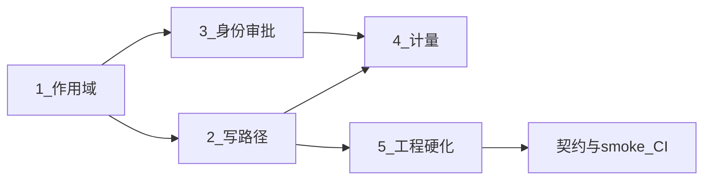

# 实施方案：近端对齐生产写路径

> **状态**：执行中（文档与工程启动项已落地）  
> **日期**：2026-08-21  
> **对应**：根 [README.md](../README.md) 路线图「近端」· [ADR-014 作用域三层](./adr/ADR-014-scope-layers.md) · [硬删审计表](./审计-硬删PersistDelete覆盖.md)

## 1. 目标

在 monolith 默认拓扑下，把控制面从「可联调」提升为「可上生产写路径」：

| # | 工作流 | 一句话 |
|---|--------|--------|
| 1 | 作用域统一 | 组织 / 工作区 / 个人目录与启用、绑定一致 |
| 2 | 企业写路径 | 模型/渠道/记忆/知识生产写语义；硬删 Persist 全覆盖 |
| 3 | 身份与审批 | 真实 IdP；多人会签、SoD、深链 |
| 4 | 计量诚实 | 持久 UsageMeters；无数显示 `—` |
| 5 | 工程硬化 | Handler 迁包；契约 / smoke CI 入库 |

**原则**：工作区硬隔离；伙伴只引用已发布版本；硬删必须 `PersistDelete(Sync)`；staging/production 才双人会签；先契约后迁包。

## 2. 依赖顺序

## 3. 工作流详案

### 3.1 作用域统一

见 [ADR-014](./adr/ADR-014-scope-layers.md)。

| 阶段 | 工作 | 验收 |
|------|------|------|
| S1.1 | ADR + schema（Catalog / Enable / Binding） | ADR 已接受 |
| S1.2 | Store + `/api/catalog*` · `/api/bindings*` | 契约测试 |
| S1.3 | 五中心 list/get 合并三层 | 跨区未启用不可装配 |
| S1.4 | 前端「组织 / 工作区 / 我的」 | UX 验收 |
| S1.5 | 存量 `scope=workspace`；收敛 `w1` 壳策略 | 迁移脚本 |

### 3.2 企业写路径

| 阶段 | 工作 | 验收 |
|------|------|------|
| S2.1 | DELETE × PersistDelete 审计（见 [硬删审计表](./审计-硬删PersistDelete覆盖.md)） | 表内缺口关闭 + 单测 |
| S2.2 | 写路径 × 环境矩阵对齐 `dual_approval` | staging 普通用户须批 |
| S2.3–S2.6 | 模型/知识/记忆/渠道生产对接 | 集成测 / 重启不回潮 |
| S2.7 | 技能卸载：库 + 本地包目录 | `hard_delete_persist_test` |

### 3.3 身份与审批

| 阶段 | 工作 | 验收 |
|------|------|------|
| S3.1 | staging OIDC（Authentik/Dex）；禁 mock | `E_IDENTITY_MOCK_FORBIDDEN` |
| S3.2–S3.3 | 统一 ApprovalTicket + 会签 SoD | `kernel_phase4` E2E |
| S3.4–S3.5 | 深链 UX + AuditEvent | 审计可搜 |

### 3.4 计量诚实

| 阶段 | 工作 | 验收 |
|------|------|------|
| S4.1–S4.2 | UsageEvent 埋点 + PG 表 hydrate | 持久 meter |
| S4.3–S4.4 | workspace 归属 + 预算门禁 | 超限明确错误码 |
| S4.5 | 总览只绑 UsageMeters | 无数为 `—` |

### 3.5 工程硬化

| 阶段 | 工作 | 验收 |
|------|------|------|
| S5.1 | `.github/workflows` 入库（本仓已启用 `backend-contract.yml`） | PR 跑 Go test + 契约探针 |
| S5.2 | smoke-monolith 文档化；重栈可选 job | 本地 `make smoke-monolith` |
| S5.3 | Handler 按域迁包（policy → collab → cap） | 路径不变、行数下降 |

## 4. 里程碑（约 10–14 周）

| 周 | 焦点 | 退出标准 |
|----|------|----------|
| W1–W2 | ADR 作用域 + CI | API 可测；PR unit/contract |
| W3–W5 | 硬删 + 写路径；OIDC | 重启不回潮；OIDC 可写 |
| W6–W8 | 会签 + 渠道/记忆晋升 | 会签 E2E |
| W9–W10 | Usage 持久化；迁包第一刀 | 真实 meter |
| W11–W14 | staging 验收清单 | 近端五项全绿 |

## 5. 本周已启动项

- [x] 本文档  
- [x] ADR-014 作用域三层（草案）  
- [x] 硬删 PersistDelete 覆盖审计表  
- [x] GitHub Actions `backend-contract` 解除 ignore 并纳入仓库  
- [ ] 作用域 API 实现（后续 PR）  
- [x] 审计表缺口关闭（个人流程模板硬删已补；记忆仍为软删须产品确认）
- [x] 工作区 Header 伪造恢复硬 403（`resolveWorkspaceCtx`）

## 6. 相关锚点

- 环境与 Persist：[环境与数据模式.md](./环境与数据模式.md)  
- 拓扑：[../backend/deploy/topology-split.md](../backend/deploy/topology-split.md)  
- 后端说明：[../backend/README.md](../backend/README.md)  
- 内核契约：[adr/ADR-013-agent-os-kernel.md](./adr/ADR-013-agent-os-kernel.md)  
- 硬删单测：`backend/internal/server/hard_delete_persist_test.go`
